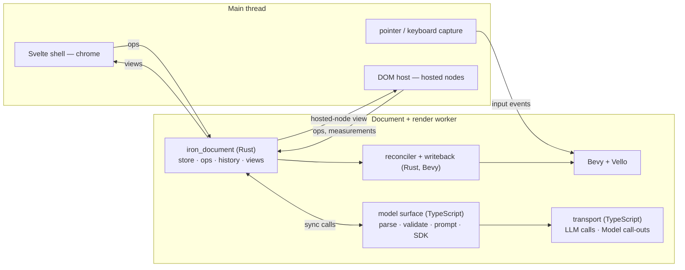

# The document spine

**Status:** Decided — implementation plan
**Date:** 2026-09-08
**Scope:** The first layer to build: an identity-stable authored store, its operation
log, and the loop that materialises it into Bevy and writes direct manipulation back.
Records the decisions that shape the store's public types, the process layout those
decisions imply, and the first vertical slice that proves them.
**Supersedes:** the build-order disagreement between
[`vision/08_native-target-via-tauri.md`](vision/08_native-target-via-tauri.md) §1 ("nothing
before the raster cache") and [`vision/02`](vision/02_substrate-model-projection-control.md)
§13 / [`vision/04`](vision/04_architecture-an-llm-editable-scene-document.md) §11 (spine
first). Spine first. Amends doc 04 §5.1 on where the store lives.

---

## 0. Decisions at a glance

| Question | Decision |
|---|---|
| What is built first | The authored store, ops, undo, reconciler, and writeback — before the raster cache |
| Where the store lives | A Bevy-free Rust crate, compiled into the same wasm as Bevy, in the worker |
| Leaf addressing | `(NodeId, path)`; the set op is path-based; components are typed Rust structs |
| Property slots | An enum from day one: `Const` now, `Bound` and `Animated` reserved |
| 2D convention | y-down, origin top-left, matching SVG, kurbo, and the DisplayList seam |
| Identity | Opaque newtype over `u64`, per-document counter, never reused, short base62 in views |
| File format | Canonical JSON: flat node table, sorted keys, one record per line; optional JSONL history |
| Model (LLM) surface | TypeScript, in the document worker, calling the store synchronously |
| Network | All of it in TypeScript. The wasm is network-free |
| DOM's role | A third renderer backend for a designated class of nodes, plus editor chrome |
| Inspector | Write half retired. Read half optional, relabelled as a view of derived state |

---

## 1. Why the spine first

Every vision document defines its central mechanism in terms of a mutation to an
identity-stable document:

- doc 01 §5 and doc 07 §5.1 define *damage* as the union of a node's old and new bounds
  after a mutation, and say the operation log should be the source of the dirty queue;
- doc 02 §8 defines *writeback* as a value flowing home to a document node via provenance;
- doc 04 §3 defines *undo*, *Bevy sync*, and *model invalidation* as three consumers of one
  op log;
- doc 05 §3 defines animation targets as *relations* in the store.

None of those consumers can be built or tested without the producer. Doc 07 §10 Stage 1
says so directly: "replace unconditional display-list reconstruction with revision-driven
dirty queues *where the authoritative document exists*." It does not.

Doc 04 §12 ranks op discipline, stable identity, and the authored/derived split as the
three most expensive things to retrofit. Every demo system written before the spine exists
is a violation that will later have to be hunted down. The code has several already
(`DraggableSquare`, `MiniSquare`, `TimelineState`, the inspector's write path).

The raster cache follows, with real revisions to consume.

---

## 2. Vocabulary

"Projection" was carrying four meanings across the vision set. Doc 03 §2 asked for the
first two to be normalised; doc 04 then added a third. Fixed here, and used consistently
from this document on:

| Sense | Source | Name from now on |
|---|---|---|
| The lossy, parameterised usage of a Model's output; by extension the authored document as wrapper data around Model invocations | doc 02 §2.2 | **Projection** (keeps the word) |
| The renderer-neutral 2D/3D drawing primitives derived from resolved values | doc 01 Layer 4 | **draw intent** (already adopted by docs 03, 07) |
| A typed, elided read of the document at a fidelity budget, for the model or for a host | doc 04 §6, doc 05 §3 | **view** (*context view* when the model is the reader) |
| The geometric floor verb | doc 02 §6.2 | `project`, a function name; unchanged |

Other terms used below:

- **leaf** — an editable authored value, addressed as `(NodeId, path)`. Doc 02 invariant 2
  made concrete.
- **hosted node** — a document node materialised by the DOM reconciler rather than the Bevy
  reconciler (§4).
- **chrome** — editor UI that is not document content: panels, menus, inspectors.

---

## 3. Process and thread layout

Workers can `fetch` and open WebSockets, so the main thread has less to do than the current
code assumes.



Five message kinds cross the main/worker boundary, all keyed by `NodeId`:

| Direction | Kind | Notes |
|---|---|---|
| main → worker | input events | unchanged from today |
| both | ops / transactions | the only way authored state changes |
| main → worker | view queries; worker → main: view responses | pull; the LLM surface uses the same views in-worker |
| worker → main | hosted-node view | push; id, type, rect, z, clip, resolved props for DOM-hosted nodes |
| main → worker | measurements | intrinsic sizes of hosted nodes, read-only derived inputs to layout |

The LLM surface runs in the worker because it needs the store on every turn, and a
synchronous call into wasm costs nothing. Its transport (the official TypeScript SDK) also
handles doc 02's Model call-outs: the Rust runtime raises an *invocation request* for a
call node, TypeScript performs the request, and the result returns as a derived-value
message. All network code is therefore in one place, which is what makes the Tauri
`Channel` in doc 08 a transport swap rather than a rewrite.

A third worker for embeddings and heavy parsing (doc 04 L6) is anticipated, not built.

---

## 4. Where the DOM is used

The DOM is a **renderer backend** for a class of nodes, in exactly the sense doc 01 §2.4
uses for Vello classic and Hybrid: a consumer of resolved values that never owns them.

- Hosting is a **per-type default with a per-node override** (an enumerated-choice leaf,
  doc 06 §3). Text field, prompt, markdown, code editor default to DOM. Label, tick, callout
  default to Vello.
- **The Rust layout solver owns every rect**, DOM-hosted or not. The main thread positions
  hosted elements absolutely over the canvas from the hosted-node view. This is the current
  `Panels` mechanism run in reverse.
- **Values flow home as ops**, coalesced on commit like a drag. Intrinsic sizes flow home as
  measurements.
- **The DOM reconciler is Svelte.** A keyed `{#each}` over the hosted-node view mounts one
  component per node type from a small registry. Nothing is hand-written beyond the
  components themselves.
- **Known limit:** hosted nodes are always topmost within their region. A node that must be
  occluded by later canvas content is not a hosting candidate.

Chrome is also Svelte. Whether a *surface* is chrome-in-DOM or content-on-canvas is decided
by three tests. Any one sends it to the canvas:

1. it has a continuous, zoomable coordinate system (a time axis, a 2D field, a curve);
2. its item count scales with the document rather than with the screen, and its items can
   overlap or shrink below a pixel;
3. it must interleave with canvas content in painter order.

| Surface | Verdict |
|---|---|
| property inspector, layers tree, menus, panes, mode control (doc 05 §5.2), "why is this moving" probe (doc 05 §5.3) | DOM chrome |
| timeline, node graph, curve editor, chart brushes, viewport gizmos, selection | canvas, document content |

Hosting is not a one-way door: chrome can become document content later without a store
change.

What is reused and what is owned:

| Borrow | From | Do not adopt |
|---|---|---|
| flex/grid layout | `taffy`, used directly in the Rust solver | Bevy UI or feathers as a widget tree (a second tree; draws outside the seam; built for a DOM-less native editor) |
| hit testing | `bevy_picking` | Masonry, egui (own trees) |
| widget behaviour, as reference | `bevy_ui_widgets` headless widgets | |
| chrome components | any headless Svelte library | |

Owned: the archetype gizmos of doc 02 §9.3 plus enumerated choice (doc 06 §3), and the
timeline editor composed from them. That is the whole custom-UI budget.

---

## 5. The store crate

`iron_document`, a workspace member beside `bevy_remote_inspector`. Dependencies: `serde`,
`serde_json`. **No Bevy.** Compiles and tests natively; this is the first code in the repo
that does.

The types below are illustrative of shape, not final signatures.

### 5.1 Identity

```rust
#[derive(Copy, Clone, PartialEq, Eq, Hash, PartialOrd, Ord)]
pub struct NodeId(u64);          // opaque; allocated from Document::next_id; never reused
```

- Never encodes position. Never reused: deletion tombstones (§5.6).
- Rendered as short base62 in files and views (`#a3f`), the cheap form doc 04 §2.1 permits.
- Opaque to the model: it copies IDs from views, never constructs them.
- The newtype leaves room for an `(actor, counter)` form if collaboration ever arrives.
  Nothing else should depend on the integer.

### 5.2 Node record

```rust
pub struct Node {
    pub id: NodeId,
    pub ty: TypeId,              // index into the registry, §5.7
    pub parent: Option<NodeId>,
    pub order: OrderKey,         // fractional string key among siblings, §5.5
    pub tombstoned: Option<Version>,
}
```

### 5.3 Components and leaves

Authored data lives in typed components in sparse per-kind maps, not on the node:

```rust
pub enum Component {
    Transform2d(Transform2d),    // x, y, rot, sx, sy
    Transform3d(Transform3d),
    Fill(Fill),
    Stroke(Stroke),
    Shape(Shape),                // rect | circle | path …
    Timing(Timing),              // start, dur, easing (scripted time, doc 05)
    Slider(Slider),              // min, max, step, value
    Name(String),
    Host(Host),                  // canvas | dom — the per-node hosting override
    // …
}
```

**Typed, not a JSON bag.** The reconciler, the floor, and the layout solver all need typed
access, and a `serde_json::Value` bag would push every type error to runtime. The file
format stays generic JSON regardless (§7). The cost is that adding a component kind is a
Rust change; that is the correct place for it (doc 02 §9.6: the vocabulary is code).

A **leaf** is addressed by node and path:

```rust
pub struct LeafPath(String);     // "transform.x", "fill.color", "slider.value"
```

Paths resolve against the component registry; an unknown path is a validation error, not a
silent no-op (doc 04 §9.4: reject unknown attributes, do not strip).

### 5.4 Property slots

Every leaf is a slot, not a bare value:

```rust
pub enum Slot {
    Const(Value),
    Bound(ExprId),               // reserved: doc 02 §4, evaluator is build step 3
    Animated { base: Value },    // reserved: driven by clips via relations, doc 05
}

pub enum Value {
    Number(f64), Bool(bool), Str(String), Color([f32; 4]),
    Vec2([f64; 2]), Vec3([f64; 3]), Enum(String), Ref(NodeId),
    // Quantity { value, unit } reserved — doc 06 §5, decided later
}
```

Reserved variants are unconstructible in slice one. They exist so that adding bindings
later touches the evaluator, not every read site. This is the concrete form of doc 05 §5.2's
`const | bound | animated` control.

### 5.5 Sibling order

Fractional string keys (doc 04 §2.5), hand-rolled: the `rocicorp/fractional-indexing` scheme,
an integer part whose length is encoded in its first letter plus an optional fraction. Appending
after the last sibling increments the integer and stays short (ten thousand appends fit in four
characters); inserting between neighbours bisects the fraction. Repeatedly bisecting the same gap
costs one bit per insert, which is inherent to any scheme. Rebalance is a system op when key
length crosses a threshold; deferred until it is observed.

### 5.6 Tombstones

Deletion sets `tombstoned = Some(version)`; the record and its components stay. Consequences
doc 04 §2.4 wants: stale references fail loudly, undo of delete restores the same id,
relation targets (doc 05 §6) survive. Garbage collection only past the undo horizon and only
when nothing references the id.

### 5.7 Node-type registry

```rust
pub struct TypeSpec {
    pub name: &'static str,                 // "rect", "slider", "clip" …
    pub components: &'static [ComponentKind],  // allowed, with required flags
    pub default_host: Host,
    pub children: ChildPolicy,              // none | any | only(&[..])
}
```

One registry, in the crate, serialisable to JSON Schema. Four readers: the semantic
validator, the Bevy reconciler, the TypeScript model surface (manifest and Zod schemas,
doc 04 §9.7), and the Svelte host registry. Drift between them is what the single source
prevents.

### 5.8 Relations

First-class from day one (doc 04 §7, doc 05 §3), because slice one has a clip with a target:

```rust
pub struct Relation { pub id: RelationId, pub from: NodeId, pub to: NodeId,
                      pub rel: RelKind, pub data: Option<Value> }
```

Indexed both directions. `by_target` is the index behind the "why is this moving" probe.

Relation ids are not tombstoned: unlinking removes the row, and the inverse re-links with the
original id. `Link` therefore accepts any unused id, while fresh links take ids from
`next_relation_id`. Node ids remain never-reused.

### 5.9 Indexes and version

Derived, rebuilt on write: `children`, `by_type`, `by_component`, `by_target`. A path index
(`/scene/…`) waits until names exist and are needed.

`version: u64`, monotonic, bumped per transaction. Used for compare-and-swap by the model
surface (doc 04 §9.6). Content hashes are **not** built now; doc 04 §11 Phase 4 says
measure first.

---

## 6. Operations and history

### 6.1 The discipline

> Every mutation goes through an op. The store's mutating methods are private to the
> applier. UI handlers construct ops; they never touch the store.

### 6.2 Vocabulary

Doc 04 §3.2, with the path-based set replacing prop bags:

```rust
pub enum Op {
    Create   { id: NodeId, ty: TypeId, parent: Option<NodeId>, order: OrderKey,
               components: Vec<Component> },
    Delete   { id: NodeId },
    Reparent { id: NodeId, parent: Option<NodeId>, order: OrderKey },
    Reorder  { id: NodeId, order: OrderKey },
    Set      { id: NodeId, path: LeafPath, slot: Slot },
    AddComp  { id: NodeId, comp: Component },
    RemoveComp { id: NodeId, kind: ComponentKind },
    Link     { rel: Relation },
    Unlink   { rel: RelationId },
}
```

### 6.3 Transactions

```rust
pub struct Transaction {
    pub version: Version,        // post-apply
    pub label: String,           // "move 3 objects" — a product surface, doc 04 §3.3
    pub actor: Actor,            // Human | Model | System
    pub ts: u64,
    pub idempotency_key: Option<String>,
    pub ops: Vec<Op>,
    pub inverse: Vec<Op>,        // computed at apply time, while pre-state is in hand
}
```

Apply is all-or-nothing: validate every op against the store, apply inside a scope, roll
back on any failure, return the full error list (doc 04 §9.4 step 4, §9.5).

### 6.4 Invertibility and history

Inverses per doc 04 §3.4. Undo applies `inverse` reversed as a new transaction with
`actor: System` and label `undo: <original>`; redo re-applies `ops`. Both flow through the
same applier, so Bevy sync and validation need no special case. One stack for human and
model edits. Horizon configurable.

### 6.5 Coalescing

A gesture opens a coalescing buffer and emits one transaction on commit. Key: `(id, path)`
for `Set`; same-type ops on the same node within ~500 ms for keyboard tweaks. Never across
structural ops. The buffer lives in the reconciler layer (§10), not in the store.

---

## 7. Serialisation

**The document file is canonical JSON.** Nobody but this app reads it; JSON is what every
tool, diff, and model handles best. RON adds nothing. A CRDT library is deferred with
collaboration; the op log is its prerequisite and loses nothing by waiting.

Two rules carry the value:

1. **Flat, not nested.** Nodes in a table keyed by id, with `parent` and `order` as fields;
   components and relations in their own tables. Nesting encodes location, and the point of
   doc 04 §0.1 is that identity and location are separate. A reparent is a two-line diff.
2. **Canonical.** Sorted keys, one record per line, `schema` version at the top. Git diffs
   read as op logs.

```json
{"schema": 1, "next_id": 41, "version": 812,
 "nodes": {
   "#1":  {"ty": "group", "parent": null, "order": "a0"},
   "#2":  {"ty": "rect",  "parent": "#1", "order": "a0"},
   "#3":  {"ty": "slider","parent": "#1", "order": "a1"}
 },
 "components": {
   "transform2d": {"#2": {"x": 120, "y": 80, "rot": 0, "sx": 1, "sy": 1}},
   "slider":      {"#3": {"min": 0, "max": 1, "step": 0.01, "value": 0.4}}
 },
 "relations": [
   {"id": "r1", "from": "#9", "to": "#2", "rel": "animates", "data": {"prop": "opacity"}}
 ]}
```

History is a second, optional file: newline-delimited JSON of transactions, append-only. The
document is a snapshot; the log is provenance. The XML of doc 04 is the model's **view**,
never the file.

---

## 8. Views

Rendered **in Rust**, in the crate, because elision (doc 04 §6.3) needs the store and the
indexes. A view is a query:

```rust
pub struct ViewQuery { relation: Relation, scope: Scope, fidelity: Fidelity, depth: Option<u32> }
pub enum Relation { Tree, Timeline, Spatial, Semantic }   // Tree only in slice one
pub enum Fidelity { Skeleton, Summary, Full }
```

Output is a string in the per-relation format of doc 04 §6.4, with `elided` always marked,
and `version` in every response. The hosted-node view (§3) is a tree view at full fidelity
restricted to DOM-hosted nodes, with placements attached; it reuses the same renderer.

---

## 9. FFI

Four calls, thin, transport-agnostic (doc 08 §4):

| Call | In | Out |
|---|---|---|
| `apply` | transaction JSON | `{applied, version, aliases}` or `{errors: [...]}` |
| `view` | view query JSON | rendered view string + version |
| `history` | `undo` / `redo` | resulting version, or nothing to do |
| `document` | `load(json)` / `save()` | canonical JSON |

`web_ffi.rs` stays a shell over these. Nothing else crosses.

---

## 10. Reconciler and writeback

In the app crate (`src/document_bridge/` or similar), **not** in `iron_document`. Bevy
depends on the store; the store never depends on Bevy.

- A `NodeId ↔ Entity` map. Every materialised entity carries `Provenance(NodeId)`.
- The reconciler consumes transactions: create spawns, delete despawns, reparent mirrors
  hierarchy, set updates the typed component. A rect node becomes commands in a DisplayList
  layer; a mesh node becomes `Mesh3d` + material; a slider node becomes a gizmo drawn in
  overlay and a hit region.
- **Writeback is intents, not mutations** (doc 04 §5.3). A drag moves the entity
  optimistically each frame and emits one `Set` transaction on release, labelled
  `"move rect"`. The existing `drag_apply_system` becomes this.
- Layout: `taffy` over the document's layout components, producing rects for canvas and
  hosted nodes alike. Slice one may hand-place; the solver arrives with the first
  `row`/`col` node.

---

## 11. Slice one

> A bound slider drives a chart, one keyframed clip plays, and one model op edits the scene.

Chosen because it exercises every layer at once: store, ops, undo, reconciler, writeback,
a reactive binding, scripted time, and the model surface. Large-document performance is the
fixture (doc 01 M1), not the milestone.

Nodes: `group`, `rect`, `circle`, `mesh` (the torus), `slider`, `bar` (a chart series
whose height is bound to the slider), `clip`. The clip targets the torus through a relation.

Exit criteria, in order:

1. Dragging the rect or the torus produces one labelled transaction. Undo and redo restore
   exactly. Replaying the history from empty reconstructs the scene.
2. Save, reload, replay: identical canonical JSON.
3. Moving the slider changes the bar's height in the same frame, with no process boundary
   crossed.
4. Scrubbing the timeline plays the clip; the "why is this moving" query on the torus
   answers with the clip via `by_target`.
5. The model reads a tree view, emits one `<edit>` with a `<set>`, and the change lands in
   the same undo stack with `actor: Model`.

---

## 12. Build order

| Step | Work | Exit |
|---|---|---|
| 1 | `iron_document`: types, registry, ops, apply with inverses, history, canonical JSON, tree view | native tests: inverse restores; replay equals snapshot; cycle on reparent rejected; unknown path rejected. **Done 2026-09-18** on branch `document-spine`; `cargo test -p iron_document --target aarch64-apple-darwin` |
| 2 | reconciler + provenance; rect, circle, mesh, group | replaying a log from empty reproduces the current demo scene |
| 3 | intents: drag → transaction; coalescing; undo wired to keyboard | criterion 1 |
| 4 | load/save FFI; Svelte shell reads a tree view | criterion 2 |
| 5 | `Slot::Bound`, minimal expression evaluator (`Ref`, `Bin`, `Call` with two floor functions), slider node | criterion 3 |
| 6 | `clip` node, relations, `Timing`, playhead drives `Animated` slots; timeline panel reads the document | criterion 4 |
| 7 | TypeScript model surface: manifest from the registry, `<edit>` parser, Zod schemas, apply via FFI | criterion 5 |

Steps 1 and 2 are the spine. Step 5 is the first point at which doc 03 §5.1's decision
("Layer 2 is the reactive interpreter") becomes code. The raster cache (doc 07 §10) follows
step 7 and consumes revisions from step 1.

---

## 13. Changes to existing code

| Today | Becomes |
|---|---|
| `DraggableSquare` resource, `MiniSquare` components | `rect` nodes |
| torus spawned in `setup_3d_scene` | a `mesh` node |
| `TimelineState` resource | document `clip` nodes plus an editor-local playhead |
| overlay world space, y-up, panel-centre origin | document space, y-down, top-left origin; the panel affine maps document to screen |
| `drag_apply_system` mutating `Transform` | optimistic move + `Set` transaction on release |
| inspector write FFI (`inspector_update_component` …) | removed |
| inspector streaming | optional; relabelled as a derived-state view; not a write path |
| animated Bézier stroke, world-space demo | removed (nothing in slice one maps to them) |
| alpha stress fixture | kept behind its flag as a perf fixture |
| `Panels` (DOM → Bevy rects) | kept for chrome; hosted nodes flow the other way |

---

## 14. Tests

All native, in `iron_document`:

- **inverse**: for every op kind, apply then apply-inverse yields a store equal to the
  original (structural equality over nodes, components, relations, indexes);
- **replay**: applying a recorded log from empty produces a store whose canonical JSON
  equals the saved snapshot;
- **atomicity**: a batch with one invalid op leaves the store untouched and reports every
  error;
- **structure**: reparent-into-descendant rejected; tombstoned target rejected; unknown
  path rejected; order keys stay sorted after a thousand inserts between the same pair;
- **views**: `elided` present whenever children are omitted; an elided group at summary
  fidelity is invariant under edits to its hidden children.

---

## 15. Deferred, with the decision that keeps them cheap

| Item | Reserved by |
|---|---|
| Units as a value type (doc 06 §5) | a `Value::Quantity` variant, unconstructed |
| Content hashes and the context ledger (doc 04 §4.3, §8) | `version` exists; hashes wait for measurement |
| Components with local state and the FSM (doc 06 §1–2) | `Slot` and the registry admit new kinds without changing ops |
| Collaboration / CRDT | `NodeId` newtype; the op log |
| Path index and names | `Name` component exists; index built when queried |
| Raster cache (doc 07 §10) | transactions carry the mutations damage needs |
| Native target (doc 08) | four-call FFI; no network in wasm |
| Vello text | a `label` node type; the hybrid `text` feature and parley, measured for wasm size |
