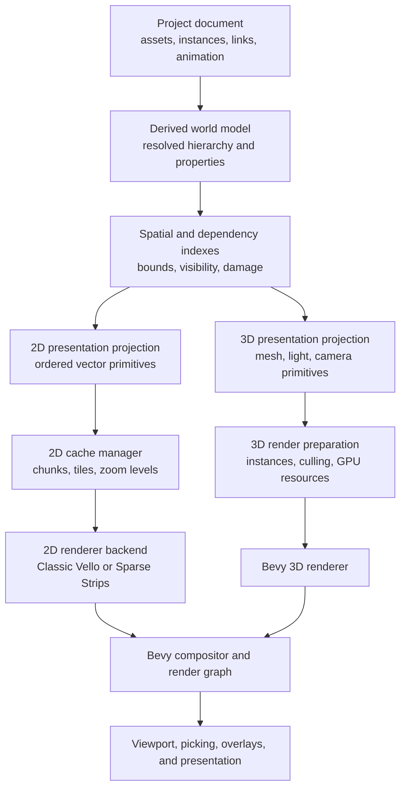

# Layered architecture for a 2D/3D composition editor

**Status:** Vision draft
**Date:** 2026-07-24
**Scope:** Architectural groundwork for an application that views, composes, links, and
animates 2D and 3D assets for pedagogy.

## 1. Product direction

The intended product is not a full replacement for Figma, Blender, or SolidWorks. It is
an environment for assembling existing and lightweight authored assets into explanatory
experiences:

- arrange and annotate 2D graphics;
- place and inspect 3D assets;
- connect 2D and 3D elements through semantic links;
- animate properties and relationships;
- coordinate cameras, timelines, callouts, and interaction;
- present the resulting composition as an explorable lesson or demonstration.

This distinction matters architecturally. The system needs strong composition,
interaction, animation, and inspection tools. It does not initially need every
domain-specific modeling operation found in a dedicated authoring package.

The central architectural goal is:

> A change should invalidate only the derived work that actually depends on it.

The document model, renderer inputs, raster caches, and Bevy runtime should therefore be
separate layers. No renderer-specific scene type should become the canonical project
representation.

## 2. Core principles

### 2.1 Keep authoritative data separate from derived data

The project document owns user intent: assets, instances, hierarchy, properties,
relationships, animation, and annotations. Bounds, visible sets, Vello scenes, meshes,
render items, raster tiles, and GPU buffers are derived caches that can be discarded and
rebuilt.

This separation makes renderer upgrades, cache invalidation, undo/redo, serialization,
and collaboration tractable.

### 2.2 Recompute by revision, never by habit

Every authoritative object and important derived artifact should carry a revision or
dependency stamp. Systems process only revisions they have not seen.

A clean frame should not:

- traverse the complete document;
- recompute world transforms or bounds;
- regenerate path geometry;
- rebuild unchanged renderer scenes;
- upload unchanged resources;
- rerasterize unchanged 2D content;
- rebuild unchanged meshes or material bindings.

### 2.3 Bound work spatially

Changes should produce conservative damage bounds. Spatial indexes turn those bounds into
small work sets: affected tiles, visible objects, overlapping layers, selectable objects,
or 3D acceleration-structure entries.

The system should prefer bounded local work over global “rebuild the scene” operations,
even when global rebuilds are initially simpler.

### 2.4 Treat renderers as backends

Classic Vello, Vello Hybrid, Bevy's 3D renderer, and possible future renderers should
consume a renderer-neutral presentation model. Backend-specific caches may exist, but
they must not leak into document semantics.

### 2.5 Share concepts across 2D and 3D, not accidental implementation details

Stable identity, hierarchy, transforms, asset instances, animation, selection, links,
visibility, bounds, and invalidation can be shared at a high level.

Painter-ordered paths and depth-tested meshes should remain different presentation
primitives. A forced lowest-common-denominator render scene would make both domains worse.

## 3. Layered system



### Layer 1: project document

The project document is the durable source of truth. It should use stable document IDs
that survive save/load, undo/redo, ECS remapping, and collaboration.

Likely concepts include:

- `Project`;
- `Asset`;
- `AssetInstance`;
- `DocumentNode`;
- `Group`;
- `Transform2d` and `Transform3d`;
- property values and overrides;
- animation tracks and clips;
- semantic links and constraints;
- annotations, labels, callouts, and hotspots;
- cameras, views, and presentation states.

Bevy entities may mirror active document nodes, but entity IDs should not be the durable
identity of project content.

### Layer 2: resolved world model

This layer evaluates document intent into values suitable for interaction and
presentation:

- inherited properties;
- composed transforms;
- asset-instance overrides;
- animation samples;
- constraint or link results;
- resolved visibility;
- effective opacity and style;
- active camera and presentation state.

Evaluation should be dependency-driven. A changed animation track should update only its
targets and downstream dependants.

### Layer 3: spatial and dependency indexes

This layer answers:

- What is visible in this view?
- What intersects this damage rectangle?
- What needs re-rendering after this edit?
- What is under the pointer?
- Which cached artifact depends on this object?

Useful structures include:

- 2D AABB index;
- 3D bounding-volume index;
- parent/child dependency graph;
- asset-to-instance reverse index;
- property dependency graph;
- object-to-cache-entry reverse index;
- dirty queues with deduplicated IDs.

Focused Understory crates such as `understory_index`, `understory_box_tree`,
`understory_presentation`, and `understory_view2d` are candidates for this layer. They can
also serve as references for a Bevy-native implementation.

### Layer 4: presentation projections

The presentation layer contains resolved drawing intent, not editor semantics.

The 2D projection should produce ordered primitives such as:

- fill path;
- stroke path;
- image;
- text/glyph run;
- clip or mask;
- opacity/blend/filter layer;
- cached image reference.

The 3D projection should produce:

- mesh instance;
- material instance;
- light;
- camera;
- environment;
- line, gizmo, annotation, or billboard;
- visibility and layer membership.

Presentation primitives should retain source document IDs for picking, diagnostics, and
incremental invalidation.

### Layer 5: cache and realization

This layer decides which presentation data remains vector/live and which becomes a
retained raster or GPU resource.

The 2D cache hierarchy should support:

1. **Geometry cache** — parsed paths, text layout, stroke expansion inputs, bounds.
2. **Display-list chunks** — ordered primitives grouped by stable document or spatial
   boundaries.
3. **World-space raster tiles** — rendered output for a spatial region at a zoom bucket.
4. **Subtree images** — retained rasterization of complex static groups where tile
   boundaries are inconvenient.
5. **Transient gesture proxies** — previous-resolution tiles scaled during zoom or other
   interaction.
6. **GPU resource cache** — image atlases, glyph atlases, textures, samplers, and backend
   buffers.

The 3D side will eventually need analogous but domain-specific caches:

- shared meshes and materials across instances;
- texture and environment caches;
- prepared instance buffers;
- visibility results;
- optional acceleration structures;
- shadow, reflection, or impostor caches.

The cache manager should own memory budgets and eviction. Renderer backends should report
resource costs rather than silently growing without policy.

### Layer 6: renderer backends

A renderer backend should receive a bounded presentation workload and a target. A
conceptual interface is:

```rust
trait VectorRasterizer {
    fn prepare_resources(&mut self, changes: &[ResourceChange]);
    fn rasterize(
        &mut self,
        display_list: &DisplayList,
        target: RasterTarget,
        clip: DeviceRect,
        transform: Affine,
    ) -> RasterResult;
}
```

The real API will need asynchronous GPU preparation and Bevy render-world integration,
but its ownership boundary should remain similar:

- document code does not know Vello types;
- cache policy does not know Bevy entities;
- the renderer does not decide document invalidation;
- the Bevy host does not regenerate geometry simply because a frame occurred.

### Layer 7: Bevy host and compositor

Bevy remains valuable for:

- windowing and input;
- cameras and viewports;
- render graph and GPU ownership;
- 3D rendering;
- runtime ECS projections;
- picking integration;
- scheduling;
- animation playback;
- compositing cached 2D tiles with 3D views and overlays.

The Bevy integration should be thin enough that the document and cache layers can be
tested headlessly.

## 4. Frame lifecycle

Each frame should progress through explicit queues:

1. **Apply mutations**
   - user edits;
   - timeline advancement;
   - asset load completion;
   - external or collaborative changes.
2. **Resolve dependencies**
   - derived properties;
   - hierarchy transforms;
   - linked values;
   - animation outputs.
3. **Calculate damage**
   - old and new visual bounds;
   - affected dependants;
   - cache entries requiring invalidation.
4. **Update indexes**
   - moved/added/removed objects;
   - visibility and picking structures.
5. **Realize presentation**
   - rebuild only dirty display-list chunks;
   - query visible content for dirty regions.
6. **Prepare rendering**
   - rasterize dirty 2D tiles;
   - update dirty 3D resources and instance data;
   - perform required uploads.
7. **Compose**
   - reuse clean cached tiles and GPU resources;
   - draw transient overlays;
   - submit Bevy render graph work.

The scheduler should expose timings and work counts for every stage. “Frame time” alone
does not reveal whether a regression came from document evaluation, scene compilation,
GPU upload, rasterization, or composition.

## 5. 2D invalidation and tile rendering

When a 2D object changes:

1. Preserve its previous visual bounds.
2. Resolve its new geometry, transform, style, and bounds.
3. Union old and new bounds, inflating for stroke, blur, shadow, and filters.
4. Mark intersecting tiles dirty at the active zoom bucket.
5. For each dirty tile, query all primitives intersecting it.
6. Rebuild that tile's display list in painter order.
7. Rasterize the tile and replace its atlas entry.

This preserves correct ordering even when the edited object lies between unchanged
objects. Drawing the edited shape as a topmost overlay would be incorrect in that case.

Selection handles, guides, cursor feedback, and similar controls should use a separate
live overlay layer. They change frequently and are cheap enough not to cache.

### Pan

Tiles are anchored in world space. Panning changes their composite positions and requests
new tiles only along newly exposed edges. Clean tiles do not invoke the vector renderer.

### Zoom

Tiles are keyed by a discrete zoom bucket. During continuous zoom:

- scale the nearest available tiles as a temporary proxy;
- prioritize tiles near the viewport center or pointer;
- progressively rasterize the new zoom bucket;
- replace proxy tiles as exact tiles arrive;
- evict old zoom buckets according to memory policy.

Live vector overlays can remain crisp while the background settles.

### Local edits

Only tiles intersecting the conservative damage region are rebuilt. Complex unchanged
geometry outside those tiles performs no CPU compilation, upload, or GPU rasterization.

There is no way to guarantee constant edit cost: a very large blurred object or a shape
overlapping the entire viewport genuinely damages a large region. The goal is to make
cost proportional to actual damage rather than total document size.

## 6. Classic Vello backend

Classic Vello stores a resolution-independent encoding and performs flattening and
rasterization on the GPU. It supports appending child scenes with a transform.

### Best use

- live vector layers;
- frequently transformed content;
- correctness baseline;
- dirty tile rendering;
- scenes where GPU compute performance is acceptable.

### Reuse strategy

- retain one Vello encoding per display-list chunk;
- rebuild only chunks affected by document changes;
- append only chunks needed for a dirty tile or live view;
- apply camera/tile transforms at append time;
- reuse image and glyph resources;
- render clean content from raster tiles rather than resubmitting it to Vello.

### Remaining repeated work

If classic Vello is used as one full-view renderer, the GPU processes the complete
submitted scene each frame. Retained encodings avoid reconstructing paths on the CPU, but
unchanged complex shapes still consume GPU work.

The tile cache is what removes that repeated GPU work. Vello should normally see dirty
tiles and small live overlays, not the complete document on every frame.

### Risks

- browser compute-shader startup cost, especially the issue described in
  [Vello #936](https://github.com/linebender/vello/issues/936);
- full-scene GPU work if the cache is bypassed;
- per-frame O(encoded bytes) aggregation when many retained scenes are appended;
- GPU-specific performance cliffs.

## 7. Sparse-strips / Vello Hybrid backend

Vello Hybrid generates device-space strips and antialiasing coverage on the CPU, then
uses GPU render passes for painting and compositing.

### Best use

With the current public API, its strongest role in this architecture is:

> A rasterizer for bounded dirty tiles or static subtree images, not the retained
> document scene.

The tile cache changes the unfavorable invalidation model. A pan does not require moving
or regenerating a monolithic hybrid scene; Bevy composites existing tile textures. A
local edit regenerates only the intersecting tiles. Zoom regenerates a new bucket
progressively while older raster tiles act as proxies.

### Reuse strategy

- create a hybrid `Scene` for one dirty tile or small batch of compatible tiles;
- cull and transform source primitives into that tile's device viewport;
- record and render it once into an atlas slot;
- retain the resulting raster tile;
- discard or reset the temporary hybrid scene;
- do not invoke hybrid for clean tiles.

This architecture exploits hybrid's likely startup and compatibility benefits without
requiring its `Scene` to provide cross-frame document retention.

### Remaining repeated work

Within each dirty tile, current hybrid still:

- generates strips for all primitives in that tile;
- builds its render schedule;
- uploads alpha and strip data;
- executes the required passes.

The tile size and spatial index bound this work. Tile statistics should guide whether to
split an unusually complex tile, cache a subtree, or fall back to a different backend.

### Experimental strip cache

`vello_hybrid` 0.0.6 is notable because it:

- uses the same `wgpu` generation as Bevy 0.18;
- contains the subsequently removed `Recording` API for cached-strip replay.

A fork of that version could test strip reuse for stable display-list chunks. This is
research, not a dependable upstream path: the API was later removed because of memory
cost, feature friction, and lack of internal use. Any production use would make this
project responsible for maintaining and evolving the feature.

### Risks

- current releases do not share Bevy 0.18's `wgpu` version;
- monolithic pan, zoom, and local edits require excessive CPU re-recording;
- recorded geometry is viewport- and transform-dependent;
- upstream deliberately removed cross-frame strip recordings;
- WASM SIMD must be explicitly enabled and verified;
- performance and memory policy are still evolving.

Detailed evidence is recorded in:

- [`../bevy-vello-hybrid-design.md`](../bevy-vello-hybrid-design.md)
- [`../bevy-vello-hybrid-open-questions.md`](../bevy-vello-hybrid-open-questions.md)

## 8. Choosing between the two Vello paths

The architecture should permit both backends long enough to measure them on the actual
product workload.

| Situation | Initial preference |
|---|---|
| Live path editing and arbitrary transforms | Classic Vello |
| Full-view vector fallback | Classic Vello |
| Dirty raster tile with many static primitives | Benchmark both |
| Browser where compute startup is unacceptable | Hybrid, if the startup test succeeds |
| Clean cached content | Neither; composite the retained texture |
| Selection handles and lightweight overlays | Whichever integrates most simply |

The comparison must measure:

- time to first paint;
- document-to-display-list time;
- dirty-tile compilation time;
- CPU scheduling and upload time;
- GPU raster time;
- tile-composition time;
- memory by cache class;
- pan, zoom, local edit, animation, and idle frames separately.

## 9. Shared 2D/3D abstractions

The following are promising shared concepts:

- stable document and asset IDs;
- hierarchy and instances;
- local and world transforms;
- bounds and visibility;
- property paths and overrides;
- animation tracks;
- dependency and semantic links;
- selection and hover state;
- undoable commands;
- dirty revisions and damage events;
- cameras and named views;
- annotations and pedagogical metadata;
- renderer-neutral resource handles.

The following should remain domain-specific initially:

| 2D | 3D |
|---|---|
| Paths and text layouts | Meshes and skeletons |
| Painter order | Depth, transparency sorting, and render phases |
| Fill/stroke/clip | Materials, lights, and environments |
| World-space raster tiles | Visibility, LOD, instancing, and shadow caches |
| Device-space antialiasing | Surface shading and postprocessing |

A shared `PresentationPrimitive` enum is likely too broad. Prefer a shared project and
dependency model with separate `Presentation2d` and `Presentation3d` projections.

## 10. Pedagogy-specific composition

Pedagogical links should be first-class document data, not incidental UI state. Examples:

- a 2D label targets a 3D part;
- a timeline event highlights a diagram region and a mesh simultaneously;
- a camera bookmark activates matching annotations;
- a 3D measurement drives a 2D graph;
- a selected concept reveals prerequisite or causal links;
- an animation track coordinates a 2D schematic with a 3D mechanism.

These relationships belong above either renderer. They can produce derived 2D and 3D
presentation changes through the same dependency system.

## 11. Suggested package boundaries

Names are illustrative:

- `iron_document`
  - authoritative project graph, stable IDs, assets, links, animation, undo.
- `iron_world`
  - resolved properties, hierarchy, dependency evaluation.
- `iron_spatial`
  - 2D/3D indexes, bounds, visibility, damage.
- `iron_presentation`
  - renderer-neutral 2D and 3D presentation projections.
- `iron_canvas_cache`
  - 2D tiles, zoom buckets, atlas policy, invalidation, eviction.
- `iron_vector_renderer`
  - backend interface and shared display-list definitions.
- `iron_vector_vello`
  - classic Vello backend.
- `iron_vector_hybrid`
  - sparse-strips experimental backend.
- `iron_bevy`
  - ECS projection, input, cameras, render graph, 3D host, composition.

These need not all begin as separate Cargo crates. They should begin as ownership
boundaries that can later be extracted when dependency direction is stable.

## 12. Performance invariants

The implementation should maintain these invariants:

1. An idle frame performs no document or geometry rebuild.
2. A clean cached 2D tile never invokes a vector renderer.
3. A local edit does not traverse the complete document.
4. Panning does not invalidate tile contents at a fixed zoom bucket.
5. Zoom has an explicit proxy and refinement policy.
6. Asset instances share immutable geometry and GPU resources.
7. Animation evaluates only active tracks and affected dependants.
8. GPU uploads are tied to resource revisions, not frame count.
9. All caches have observable memory use and an eviction policy.
10. Every full-scene fallback is instrumented so it cannot become an invisible normal
    path.

## 13. Recommended first milestones

### Milestone 1: renderer-independent benchmark document

Create a synthetic but representative document containing:

- tens of thousands of 2D paths;
- nested groups and clips;
- several large complex SVG-like objects;
- images and text;
- a small 3D scene;
- cross-domain annotations;
- animated and editable objects.

Give every object stable IDs and bounds. This becomes the permanent performance and
correctness fixture.

### Milestone 2: document revisions and spatial damage

Implement stable document nodes, property revisions, transform propagation, bounds, and a
2D spatial index. Demonstrate that editing one shape produces a bounded damage report
without traversing all nodes.

### Milestone 3: classic Vello dirty-tile backend

Implement painter-correct tile display lists, atlas allocation, tile rendering, and Bevy
composition. Validate idle, pan, zoom proxy, and local edit behavior.

### Milestone 4: hybrid backend comparison

Resolve `wgpu` compatibility, enable WASM SIMD, run the #936 startup test, and implement
the same tile-rasterizer interface. Compare it with classic Vello using identical display
lists and targets.

### Milestone 5: 3D projection experiment

Project the same document identity, animation, link, selection, and revision concepts
into Bevy 3D. Record which abstractions genuinely transfer and which require
domain-specific representations.

## 14. Current architectural decision

The project should not begin by building `bevy_vello_hybrid` as a general entity renderer.
It should begin by building the renderer-independent document, damage, and cache layers.

Classic Vello and sparse strips remain viable backend experiments:

- classic Vello is the stronger live-vector backend today;
- sparse strips may be the stronger bounded tile rasterizer on affected web hardware;
- cached textures should handle the majority of unchanged content in either case.

This turns renderer choice from an irreversible architectural commitment into a measured,
replaceable implementation decision.
