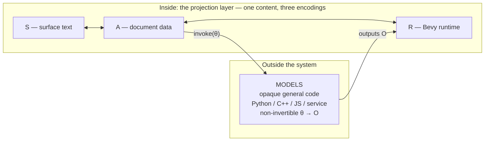

# Model, projection, and bijective control

**Status:** Vision draft
**Date:** 2026-07-24
**Scope:** The representation and control substrate for a scientific-visualization and
science-communication tool, in which a language model authors scenes and behaviour, a
human edits them directly on a Bevy canvas, and both operate over the same data.

---

## 1. Problem statement

Three demands must be satisfied by one representation:

1. **A language model can author it.** Scenes, layout, reactivity, and behaviour
   generated from natural language.
2. **A human can edit it directly.** Dragging objects on the wgpu canvas, tuning sliders,
   rewiring graphs — with those edits flowing back into the same representation the model
   reads and rewrites.
3. **It runs.** It materialises into live Bevy entities and components and behaves as a
   real interactive visualisation.

The naive obstruction is that authored source normally *compiles* into a more verbose
runtime form, and that compilation is lossy. Lowering a component language to a
reconciler plus imperative scene mutations is many-to-one; it cannot be reversed. If a
lossy lowering sits between the thing edited and the thing that runs, the loop cannot
close.

The resolution is not to invent an invertible compiler. It is to **move the
non-invertible computation out of the loop entirely**, so that everything remaining
inside is data, and data round-trips by construction.

---

## 2. The ontology

Scientific visualisation decomposes into three layers with sharply different properties.

### 2.1 Model

The **most authentic representation of the system under study**: a function, program, or
service mapping inputs **θ** to outputs **O**.

- It is complex, requires general control flow, and is *legitimately code*.
- It is written in whatever language the scientist already uses — Python, C++, Julia,
  JavaScript — and reached through an API, socket, or process boundary. Attempting to
  move researchers onto a new language for this layer is a fool's errand; the API
  boundary is the correct abstraction.
- Its outputs are typically huge and high-dimensional: the trajectories of thousands of
  photons, the wave dynamics of a body of water, a finite-element solution field.
- **The map θ → O is many-to-one and non-invertible.** Nobody edits O with a mouse.

Critically, **the Model lives outside the visualisation system entirely.** The system
holds only an *invocation spec* — which model, bound to which input leaves — never the
model's internals.

This is where the instinct that "true application state is hidden as code somewhere"
resolves correctly. The Model is *supposed* to be opaque. It is an honest opaque
function, touched only through its input leaves. Transparency is owed by the layer the
user interacts with, and that layer is entirely inside the system and entirely
inspectable.

### 2.2 Projection

The **usages** of a Model: transformations of O and θ into perceptible visual or
linguistic form. Projections are necessarily **lossy**, because the Model's output is
high-dimensional and perception is not.

Projections *model an experiment in the real world*: which fraction of the output photons
are observed, filtered by wavelength; from what angle the simulated waves are viewed;
which slice, which colour scale, which aggregation. Projections carry their own
parameters **φ**, and those parameters are the controllable surface.

**Projections are data.** The document that arranges them, binds them, and wires them
together is itself projection-like — it is wrapper and arrangement data around Model
invocations. It is not "the program." The Models are the programs.

### 2.3 Annotation

Authored meaning laid *over* the scene: arrows, callouts, captions, highlights, the
ordered sequence of an explanation, the correspondence between a natural-language claim
and a region of the visualisation.

This is neither Model (no computation) nor Projection-of-output (authored, not derived).
It is the **most bijective and most mouse-native layer of the three**, and for science
*communication* — as distinct from bare analysis — it carries most of the message. A
two-part theory that folds annotation into projection systematically under-weights the
part of the work that does the explaining.

### 2.4 The governing invariant

> **Model and Projection are *roles*, not *types*. The invariant controllable surface is
> the *parameter-leaf set* — model inputs θ, projection parameters φ, authored structure,
> and annotation — regardless of which box consumes them.**

Two corollaries make every fuzzy case decidable:

**Choosing among predefined computations is a leaf; authoring a new computation is code.**
Selecting "force-directed versus layered layout," or "linear versus logarithmic colour
scale," is setting an enum-valued φ — bijective, mouse-controllable — even though it
changes the *kind* of computation performed. Writing a *new* layout algorithm is editing
the code layer. This is the exact resolution of the layout question: selection among
options is projection data; authoring is a drop to code.

**Projections nest sub-models.** A transfer function, a t-SNE embedding, a kernel density
estimate, a constraint solver coupling two sliders — all are "projections" containing
real, non-invertible computation. The Model/Projection boundary is a **gradient, not a
wall**. What survives the gradient is the leaf surface: it stays bijective on both sides,
which is what lets the architecture survive the messy middle.

The real dividing line is therefore **leaf versus derived**, and secondarily
**choose-among versus author-new**. Model-versus-Projection is a useful organising story;
leaf-versus-derived is the operative rule.

### 2.5 Attempted falsifications

Each of these looks like a counterexample and is not:

| Case | Resolution |
|---|---|
| **Inverse problems / curve fitting** | Dragging the fitted output is not editing O; it is setting the *input* of an inverse model whose output is θ. Both directions are just Models. Residue: one gesture can mean "set forward input" or "assert inverse target" — a genuine ambiguity, routed to §8. |
| **Parameter sweeps / small multiples** | A higher-order projection that invokes the Model many times. Requires bounded combinators (map/filter/zip over invocations), not arbitrary control flow — see §4. |
| **Feedback loops** (camera drives adaptive refinement; user perturbs a running simulation) | Breaks the clean upstream→downstream *layering* — a projection→model edge appears — but not leaf-versus-derived. The pipeline becomes a graph; every edge is still "set a leaf" or "run a model." |
| **Stochastic / ensemble models** | The RNG seed is an input leaf; ensemble→summary is a projection. "Show another sample" increments a leaf. |
| **Live instrument data** | A degenerate Model with no controllable inputs. Projection control still applies; the mouse collapses almost entirely to projection control, which supports the thesis. |
| **Structure-valued objects** (molecule, circuit, causal graph) | If authored, it is a structural leaf edited through the relation/containment/sequence archetypes of §9. If derived from data, it is the inverse-problem case. |

No fundamental science-communication situation falls outside the ontology once the split
is treated as a porous role with the invariant located at the leaf surface, and
Annotation is admitted as the third term.

---

## 3. Three co-equal encodings

Inside the system, the projection content exists in three forms:

| Symbol | Name | Role |
|---|---|---|
| **S** | Surface syntax | Concise text; what a language model most naturally emits and reads |
| **A** | Document / AST | Serialised structured data (RON/JSON); what the visual editors manipulate; what is version-controlled |
| **R** | Runtime | Live Bevy entities and components; what executes and renders |



**These are not a source plus two lossy views.** None of the three is privileged as "the
program." They are three mutually bijective encodings of the same content. The AST is
itself projection-like: wrapper data around Model invocations.

**Their interconvertibility is a consequence, not a coincidence.** S, A, and R round-trip
*precisely because* the only genuinely non-invertible thing — opaque general computation —
has been exiled to the Model layer outside the equivalence class. Strip the opaque
computation out, and what remains is pure data.

The dividing line for what may live inside is **declarative-structured versus
opaque-general**. Declarative reactivity — signals, derived values, conditional and
repeated structure — is data and stays inside. Arbitrary algorithms go outside.

### 3.1 Canonical by convention, not by nature

Although R ⇄ A is bijective in principle, **A is chosen as the edit hub by convention**,
because it is where stable identity, versioning, diffing, and collaboration are managed.
Edits made in R are funnelled through A rather than accumulating in the runtime. This is
an engineering decision, not a claim that R is fundamentally lossy.

### 3.2 What structural bijectivity does *not* cover

Structural bijectivity — S, A, and R interconvert — is a different claim from
*value-level* invertibility. Dragging an object whose position is bound to
`centerX + i * spacing` raises the question of how to distribute the new value across its
inputs. That is a question about inverting a *value* through a derived expression, and it
is underdetermined. It does not dent the structural claim. Both are true at once, and §8
handles the second.

---

## 4. The projection language

Everything inside the system is authored as data walked by fixed interpreters. No code is
generated; no Bevy systems are authored. A small set of Rust systems interpret the
document every frame.

Most "control flow" in a reactive presentation layer is not arbitrary control flow — it is
a closed set of declarative combinators, and those are trees. That is exactly why they
are visually editable.

```
Expr    = Lit(Value) | Ref(NodeId) | Get(Expr, Field)
        | Bin(Op, Expr, Expr) | If(Expr, Expr, Expr) | Call(BuiltinId, [Expr])
Node    = Element { tag, props: Map<Name, Binding>, children: [Node] }
        | Text(Binding)
        | If   { cond, then: [Node], else: [Node] }
        | Each { items, key, item_var, body: [Node] }
Binding = Static(Value) | Dyn(Expr)
Stmt    = Set(Path, Expr) | Emit(Event, Expr) | CallS(BuiltinId, [Expr])
        | IfS(Expr, [Stmt], [Stmt])
Handler { on: Event, body: [Stmt] }
```

Reactivity maps natively onto the ECS. A **signal** is a node holding a value; a
**derived** value is an expression over other node identities; a **binding** is either a
literal or an expression. This is a dataflow graph: each signal and derived value is an
entity with a value component, dependencies are edges, and Bevy's change detection
provides dirty-tracking almost for free. The reactive runtime is idiomatic to the engine
rather than bolted onto it.

Three fixed systems interpret all of it:

1. **Reactive system** — recomputes dirty derived values and effects; pushes results into
   bound fields.
2. **Reconciler** — diffs the node tree against live entities.
3. **Event system** — runs handler statement lists in response to interaction events.

**Staging of expressiveness.** Begin with pure dataflow, declarative conditional and
repeated structure, and fixed builtins, with no user-authored loops — this covers the
overwhelming majority of interface and visualisation needs, is trivially safe, and is
trivially editable. Add bounded imperative handlers next. Reach for user-defined
functions and recursion only if genuinely required, and only with a fuel or step budget,
since an unbounded loop in a per-frame interpreter stalls the frame.

The ceilings that expressiveness runs into are **editor complexity** and **runtime
safety** — never reversibility. The document round-trips no matter how expressive the
language becomes.

---

## 5. Recovering the expressiveness of component frameworks

A legitimate worry: component frameworks mix layout and computation freely, and that
mixing is expressive. Does a declarative document with calls out to fixed functions lose
it?

**The mixing in those frameworks is syntactic, not semantic.** An inline expression such
as "the count of active items" *looks* like embedded computation, but it compiles to a
dataflow node subscribed to its dependencies. Svelte 5's runes are an explicit admission
of this: the framework stopped inferring the dataflow graph from syntax and made the
graph a first-class, user-visible object. That is a move *toward* this architecture. What
a declarative document loses is inline ergonomics — which is precisely what surface
syntax S exists to restore.

### 5.1 What component code actually does

Enumerating the operations, and why each reactive primitive exists:

- **Reactive state that is not derived** — toggles, hover, focus, selection, text
  buffers, scroll position, drag-in-progress, open/closed, active tab, undo stack.
- **Memoised pure computation** — formatting of numbers and dates, filtered and sorted
  lists, counts, computed styles, validity, "3 of 12 selected".
- **Multi-step computation** — the *function-bodied* form of derived state exists only
  because expression syntax cannot hold temporaries, loops, early returns, or the
  construction of a lookup map. It is a syntax escape hatch, not a semantic capability.
- **Effects** — the reactive graph is pure and the world is not: measurement, imperative
  drawing, third-party widget lifecycles, subscriptions, timers, persistence, document
  title, focus management, scroll-into-view, and cleanup.
- **Two-way binding** — which is a lens.
- **Reducers and state machines**; **manual memoisation**; **non-reactive mutable boxes
  and previous-value tracking**; **ambient scoped values**; **scheduling priority and
  deferral**; **external data sources**; **reusable parameterised abstractions**;
  **async boundaries**; **error isolation**.

The full operation taxonomy: local ephemeral state · formatting and internationalisation
· collection transforms (filter, sort, group, paginate, search, deduplicate, join) ·
aggregation · conditional presentation · validation · asynchronous data with loading,
error, retry, debounce and optimistic update · imperative event sequences · state
machines · time (timers, polling, debounce, animation loops) · animation and transitions
· measurement feedback · imperative escapes · persistence and external synchronisation ·
abstraction and reuse · scheduling and virtualisation · keyed identity · ambient scoped
values · non-reactive boxes · error isolation.

### 5.2 Triage

**Already covered.** Reactive state is signals. Memoised pure computation is a derived
binding. Event sequences are handlers. Conditional presentation and keyed lists are the
`If` and `Each` nodes. And the standard function library of §6 absorbs an enormous share
of the remainder: reading real component code with this lens, the overwhelming majority
of embedded expressions are filter, sort, map, count, format, compare, arithmetic, and
string operations. That is the floor.

**Evaporates entirely.** A large fraction of effects exist only to *escape the framework
into the document object model* — imperative canvas drawing, third-party chart
libraries, manual measurement. When the renderer *is* the substrate, there is nothing to
escape into; the ECS is the imperative layer and the reconciler owns it. Likewise, manual
memoisation is accidental complexity arising from coarse-grained re-rendering; a
fine-grained signal graph memoises automatically, which is why fine-grained frameworks
have no equivalent. Reconciliation keys, effect-cleanup ordering, and external-store
subscription primitives are all workarounds for a boundary this system does not have.

**Genuinely lost.** Arbitrary inline code in expressions. This is the real cost, mitigated
by the three-tier structure of §6. The residue lands on genuinely novel algorithms.

### 5.3 Node types required to close the gap

| Addition | What it recovers |
|---|---|
| **Components** — `Component { params, local_state, body }` and `Instance { component_id, args }` | The single largest gap. The real expressive power of component frameworks is not inline computation but *parameterised, composable, reusable units with local state*. Without it the document becomes a flat sprawl that neither a human nor a model can navigate, and every repeated idiom is copy-pasted. With it, the document stays small, the model edits at the right granularity, and identity stability improves because structure is shallower. |
| **Let-bindings / named intermediate derived values** | Multi-step computation. A chain of named intermediate nodes *is* a multi-step algorithm, spelled as a directed acyclic graph rather than a statement sequence. Temporaries become named nodes. Only genuinely novel algorithms fall through to the wasm tier. |
| **`Query` / `Await` node** — `{ model, args } → { status, value, error }` | Asynchrony as a *data shape* rather than an imperative sequence. Covers loading states, error boundaries, retry, and optimistic display in one node. Since Model call-outs *are* the asynchrony in this system, this is the most load-bearing addition after components. |
| **`Effect { deps, action: [Stmt] }` with an enumerated sink vocabulary** | Side effects, kept safe and inspectable because the *verbs* are floor-provided and finite: set field, spawn/despawn, request model invocation, persist, emit event, camera or focus command, start animation. The author selects which built-in sink fires when; they do not author systems. |
| **Explicit finite-state-machine node** — states, transitions, guards | Drag lifecycles, modal flows, wizard steps, connection status. Ubiquitous and currently awkward as tangled booleans. It is natively a node-and-edge structure with leaf-only handles, so it is *also* directly the state-machine visual editor of §9. |
| **Time as built-in signals** — frame time, delta, elapsed; debounce and throttle as declarative binding modifiers | Timers, polling, animation loops. A game engine has real time infrastructure, so this is strictly better than the browser situation. Animation becomes keyframe, spring, and tween nodes — which is the timeline editor. |
| **`Context` / `Provide`** | Ambient scoped values (theme, locale, units, colour scheme) as inherited attributes over the existing scene hierarchy. |
| **Measurement as read-only derived signals** | Computed layout sizes and text extents must be *readable* by the graph. Exposed as derived, never as leaves — renderable and referenceable, not draggable. |
| **`VirtualEach`, plus cost tags on expensive derived values** | Virtualisation and the cheap/expensive stratification of §6.4. |
| **Non-reactive boxes and previous-value tracking** | Small but real; trivial in an ECS. |

The honest accounting: inline syntax is lost and recovered through S; arbitrary
algorithms in the view layer are routed to wasm or call-outs; a substantial pile of
accidental complexity is *shed*; and components, asynchrony-as-data, enumerated-sink
effects, state machines, and time must be deliberately re-added. With those, the
expressiveness gap narrows to "novel algorithms" — which is exactly where the code/data
line was wanted.

---

## 6. The floor

The projection layer composes fixed functions. Those functions are the **floor**, and
they are written in Rust.

### 6.1 The criterion is latency, not taxonomy

The deciding rule is not "is this operation generally useful."

> **Anything that must recompute inside a continuous manipulation loop must be in the
> floor, because a round-trip to an external process cannot happen at frame rate.**

- **Runs continuously during a drag** → must be floor: local, Rust or GPU.
- **Runs occasionally, on parameter commit; expensive, stateful, or the actual science**
  → an external call-out is correct.

This is why the same conceptual operation can fall on either side. Principal component
analysis is cheap, deterministic, and pure — it can keep up with a drag, so it belongs in
the floor. A stochastic iterative embedding cannot keep up, so it is a call-out. The
boundary is partly *empirical*: it is populated by profiling what needs to be
interactive.

### 6.2 The vocabulary already exists

The contents of the data floor do not need inventing. They are the worked-out vocabulary
of the grammar of graphics and the dataframe verb tradition:

- **Wrangling verbs** — filter, select, derive/mutate, arrange, summarise, group, join,
  fold and pivot, window.
- **Statistical transforms** — bin, aggregate, density, regression, stack, quantile.
- **Scales** — linear, logarithmic, power, square-root, ordinal, time; colour schemes;
  domain and range.
- **Geometric operations** — project, slice, contour, sample and decimate, transform.

Each is a **pure, total, parameterised** function. Purity and totality are the price of
admission to the floor: reactivity assumes purity for dirty-tracking, and the frame
budget requires bounded cost. This is also precisely why Models — stateful, expensive,
possibly non-terminating — are correctly exiled outside: they cannot meet those
constraints and should not have to.

### 6.3 One call node, two resolutions

Floor operations and Model call-outs are **the same node in the document**. Both are the
`Call(BuiltinId, args)` form. The only difference is where the identifier resolves:

- **floor identifiers** resolve to local Rust functions;
- **model identifiers** resolve to an external dispatch — a builtin whose implementation
  is "send over the boundary."

The reactive system treats them identically — recompute when dependencies are dirty —
except that it carries a **cost annotation** meaning "expensive: debounce, run on
release, never per-frame." There are not two mechanisms. There is one uniform call graph
with a resolution table and a cost tag.

A **three-tier** structure covers the long tail:

1. **Rust floor** — fastest, standard vocabulary, always available in the perceptual loop.
2. **User-authored wasm transforms** — local and fast enough to remain in the perceptual
   loop, but written by the user. This is the interesting middle tier: it lets a
   domain-specific projection run at floor speed, which an external process call never
   can.
3. **Remote call-outs** — slow, opaque, stateful; the actual model of interest.

### 6.4 Why the floor makes interaction cheap

The Model output is cached as derived data. The dependency graph then stratifies
naturally:

- **A projection parameter φ changes** — wavelength fraction, bin width, camera angle,
  slice index. Re-run only cheap floor operations over the cached output. Per-frame,
  real-time, perceptual loop intact.
- **A model input θ changes** — mean photon energy, boundary condition. Re-invoke the
  Model: slow, debounced, on release. Regenerate the output, then re-run the floor.

The floor is precisely the mechanism that keeps the expensive call-out off the hot path.
Inner loop over cached output; outer loop on commit.

### 6.5 Residual leak

Multi-way constraint solvers — align and distribute, conservation-coupled parameters —
are the one class of floor member whose *output* is non-injective even though its
configuration is leaves. They are where the otherwise clean floor readmits a little of
the inversion problem, and they should be flagged as such.

---

## 7. What direct manipulation is for

Every edit must do two things: **ground its operands** (which thing?) and **specify its
parameters** (how much, where?).

- The **mouse supplies spatial handles**: a coordinate, a region, a continuous quantity.
- **Language supplies symbolic handles**: a name, a predicate, a quantifier.

The mouse is *irreplaceable* where the only available handle is spatial, and merely
*faster* where a symbolic handle also exists. That split predicts which uses of direct
manipulation survive arbitrarily capable language models.

### 7.1 Two durable wins

**Continuous closed-loop tuning against a perceptual objective.** Camera framing, a
volume-rendering transfer function, a threshold dragged along a histogram while watching
what falls inside it. This is durable not because the mouse is fast but because **the
objective is preverbal**: "until the bone reads but the soft tissue stays faint" lives in
the visual cortex and cannot be externalised as a specification. A zero-latency oracle
does not help, because the bottleneck was never generation — it is that the goal cannot
be handed over. The mouse closes a feedback loop whose far end is human perception. In
this regime the mouse is not prompting a change; it is *performing the task*, and the
model is irrelevant to the inner loop. **This is the architectural justification for §6:
the loop must not cross a process boundary.**

**Reference to a target that is spatially distinguishable but symbolically indistinct.**
One point among ten thousand near-identical points; "that cluster"; a freehand region.
Durable because there is no predicate to infer — the target's only handle is its
position, which a click delivers. By contrast, "the teal blob at the top left" *has* a
recoverable predicate, so a capable model absorbs that case. Deixis for nameable things
is the erodable win; deixis for the symbolically indistinct is permanent.

### 7.2 Division of labour

The mouse owns **shallow, binary, co-visible spatial relations** — dragging A onto B
encodes source, relation, and target in one stroke, beating language's double reference
tax. Language owns **composition and abstraction** — quantification, conditionals,
recursion: "for each cluster whose centroid exceeds the mean, link it to its two nearest
neighbours." Drag-to-connect is the mouse composing, but only ever at depth one; the
moment a composition contains a quantifier or a branch, it is a sentence.

### 7.3 Why this matters more in a scientific tool

Exploratory analysis forms hypotheses that could not have been stated in advance. One
cannot prompt "show me the correlation I have not noticed yet" — language requires the
concept to already exist. Brushing, orbiting, filtering, and probing are instruments for
*generating* the concepts that language later operates on.

> **Discovery is preverbal. The mouse is the hypothesis-generation channel; language is
> the hypothesis-operationalisation channel.**

### 7.4 The handoff patterns

- **Multimodal deixis** — gesture grounds a term that language then operates on:
  "connect *[drag]* these to *[click]* that one, coloured by velocity."
- **Coarse-to-fine within one task** — language makes the semantic leap ("frame the
  skull," "isolate the high-vorticity region"); the mouse performs the perceptual settle
  (the last ten percent of camera position, the final nudge of an opacity curve), because
  past a certain fineness the round-trip cost of a sentence exceeds the value of each
  adjustment.

---

## 8. Writeback: from runtime to document

The human manipulates **R**; the language model must keep editing **A**. A channel is
required to turn a runtime mutation into a document mutation.

### 8.1 Stable identity is the spine

When materialising A into R, every entity carries a provenance component — a stable node
identifier that survives edits. Dragging an object mutates its transform; change
detection fires; a system reads the provenance, locates the corresponding binding in the
document, and writes the new value home. The document stays canonical, now reflecting the
manipulation. The model then reads the *document* and makes its incremental edit.

### 8.2 Policy by binding kind

| Binding | Writeback |
|---|---|
| **Literal** | Trivially bijective. Overwrite. This is the common case for a scene editor and needs no intelligence whatsoever. |
| **Derived expression** | Not invertible in general. Setting a position to 220 when it is bound to `centerX + i * spacing` is underdetermined. |
| **Instance of a repeated structure** | The object has no position of its own; it is a shared template instantiated per item. "Move this one" may mean *edit this item's data* or *edit the template*, moving all of them. |

For the ambiguous cases the remedy is not an invertible compiler but a **policy** chosen
per interaction: reject the manipulation; detach to a literal (replacing the expression
with the manipulated value, with a visible warning that a binding was broken); edit the
underlying source if the binding is a direct reference; or prompt for instance-versus-
template.

### 8.3 The language model as ambiguity resolver

The pre-existing research tradition for this problem required *sound, deterministic*
program repair — running programs in reverse to propagate output edits into source. It
worked, and it strained exactly at these ambiguous cases, because a sound synthesiser
must either find a unique inversion or surface every candidate.

A language model does something categorically different: **plausible, context-conditioned
repair.** Given the document plus "the human dragged object #3 from x=200 to x=240," it
resolves intent the way a collaborator would — "you probably meant to change the spacing,
not the centre" — using variable names, surrounding structure, and the history of prior
edits, none of which a trace-based synthesiser can see. It dissolves the
underdetermination by *inferring intent* rather than inverting computation.

The price is plausibility in place of soundness. Therefore **every model-inferred repair
is presented as a reviewable diff, never applied silently.**

The resulting division of labour: the strict lossless path for literal bindings, with no
model involved at all; the model consulted *only* for non-injective manipulations. This
is cleaner than either all-sound-synthesis or all-inference.

### 8.4 Two disciplines that prevent self-inflicted irreversibility

**The model reads A, never R.** Given a flattened entity dump — several hundred generated
objects with concrete transforms — it loses the loop and binding structure, edits the
*expanded output*, and the reconciler is then asked to fold expanded output back into the
document, resurrecting the original irreversibility problem. Humans touch R; the model
touches A; the system synchronises R→A for **values only**.

**Identity must be preserved across model edits.** Regenerated identifiers break
provenance, force teardown and rebuild of entities, and destroy in-flight selection and
manipulation state. Instruct the model to preserve identifiers on unchanged nodes, *and*
run a structural diff to recover identity afterwards — the latter being more robust,
since models are unreliable about preserving opaque identifiers.

---

## 9. Editors as artifacts

Rather than hunting through fixed panels and submenus, the user asks for the control they
want: "give me a slider for the opacity of the centre object." The concern that this
hides real state as code is misplaced — the slider is not code and is not hidden. It is a
node in the document whose binding names a path into state. The control surface and the
state it tunes are the *same kind of thing*: both data, both inspectable, both diffable.

### 9.1 An editor is a partial sibling encoding

Because S, A, and R are co-equal bijective encodings rather than a source plus views, a
custom editor is not a "lens looking in from outside." **It is another member of the same
family — a partial sibling, bijective over the slice it covers.** A timeline is to the
keyframe leaves what the text encoding is to the whole document: a different spatial
encoding of the same underlying data. This removes the awkward question of whether an
editor is part of the truth or merely a window onto it. It is the same kind of thing as
the text and runtime encodings.

### 9.2 The single governing rule

> **A custom editor may *render* anything, but its editable *handles* must land on
> leaves.**

Display is unrestricted: leaves, derived values, even raw model output may be shown,
read-only, with no difficulty. Editing must reach the bijective leaf substrate.

This rule stratifies every editor automatically into interactive and display-only
regions. In a node editor, the node boxes representing model invocations are leaves —
add, remove, rewire them; the values flowing along edges are derived model outputs and
are display-only; the node positions are a derived layout, display-only unless detached
to literals for hand placement. In a timeline, keyframes are editable pairs; the
interpolated curve between them is read-only. The split is *predicted* by the
architecture rather than designed case by case.

It also yields the correct construction rule for §8's ambiguity: **do not offer a handle
on a derived composite.** Expose the inputs. Do not let a user drag an object positioned
by `centerX + i * spacing`; expose the centre and spacing as their own controls. Done
this way, the ambiguity never arises, because the handle was never offered.

The residual tension is ergonomic rather than architectural: sometimes the *intuitive*
grab-point is the derived composite, because the hand reaches for the output. Then the
choice is between forcing the user back to input leaves (architecturally clean,
ergonomically worse) and offering the composite handle with model-mediated repair (better
experience, messier internals). This is a per-interaction judgement, not a wall.

### 9.3 The archetype vocabulary

Infinite editors do not come from infinite *mechanics*. They come from infinite
*bindings* over a small, finite set of manipulation archetypes, each carrying a clean
writeback because its value shape is simple and the manipulation is total over it:

| Archetype | Affordance | Writeback |
|---|---|---|
| Scalar on a constrained track | slider, ring, axis drag | set a number |
| Point in 2D/3D | free-drag gizmo | set a vector |
| Interval | brush, draggable span | set a pair |
| Set by region | lasso, marquee | set membership |
| Binary relation | drag to connect | add or remove an edge |
| Sequence | drag to reorder | permute a list |
| Point on a track | keyframe drag | set a (position, value) pair |
| Containment | drag into | reparent within a tree |

A node editor, a timeline, an animation-curve editor, a layer panel — the entire fixed
catalogue of a conventional creative application — are bindings of these archetypes to
different paths plus a layout strategy. The limitation of conventional tools was never a
poverty of archetypes; it was that the bindings were hardcoded. **Making the binding
layer data is the whole move.**

Because the editor *definition* — which archetypes, bound to which paths, under which
layout — is itself leaf-configured data in the same substrate, a language model can
author a new editor by appending nodes, and a human can adjust it with the same gizmos.

### 9.4 The recursion

An editor is a miniature instance of the entire architecture: it has its own
sub-model (the layout algorithm), its own projection (the rendered arrangement), and its
own leaves (the content it edits). Everything concluded at the top level applies one
level down — the layout algorithm is selected among options rather than authored by
mouse; the rendered arrangement is non-invertible display; the content handles are
bijective.

This recursion is general. Examples from the data and interface domains:

| Projection | Sub-model (non-invertible) | Leaves |
|---|---|---|
| Histogram | binning and counting | bin width, count, range |
| Density estimate | kernel convolution | bandwidth, kernel type |
| Contour / isosurface | marching squares or cubes | iso-level |
| Volume transfer function | ray integration to colour and opacity | control points (themselves edited in a custom editor) |
| Aggregation | the reduction | grouping key, choice of reduction |
| Dimensionality reduction | the embedding | component count, perplexity — and note this concept straddles the floor boundary: cheap deterministic methods are floor, stochastic iterative ones are call-outs |
| Layout | the constraint or force solver | gap, direction, alignment, choice of solver |
| Colour scale | the mapping function | domain, range, scheme |
| Text shaping | line breaking and glyph shaping | width, font, justification |
| Easing / tweening | curve sampling | easing type, duration |
| Snap / align / distribute | multi-way constraint solve | which constraints exist |

### 9.5 When to build a custom editor

Tie the decision to §7: **build a custom spatial editor exactly when it exposes leaf
edits whose natural handle is spatial** — dragging a keyframe along a time axis, dragging
to connect two nodes, brushing a region. If the edit is symbolic — "set damping to 0.3" —
a prompt or a plain numeric field is strictly better, and a bespoke editor is
over-engineering. The architecture indicates which editors are worth building: the ones
whose leaves want fingers rather than names.

### 9.6 Where the recursion bottoms out

The archetype vocabulary and the menu of layout strategies are **code, not data**. They
can be composed and bound infinitely from data, but a genuinely new interaction archetype
or a new layout algorithm cannot be authored by mouse — that is authoring computation,
which by the governing rule drops to the code layer.

"Any editor you want" therefore means precisely: **any binding and composition over a
fixed gizmo-and-layout floor.** Something must be the first editor, written in Rust,
before editors can be authored as data. This is the same shape as every other conclusion
in this document: data plus a fixed interpreter.

---

## 10. Open problems

Not solved by "make it data":

1. **Layout is an algorithm, not a binding.** Force-directed placement, edge routing,
   timeline scaling are parameterised algorithms. A fixed menu can be offered (selection
   is a leaf) but a new strategy cannot be conjured from data. The honest ceiling.
2. **Pick semantics in dense scenes.** Every archetype assumes "you grabbed X" is solved.
   In overlapping, semi-transparent, high-cardinality fields this is its own hard problem,
   upstream of all clean writeback.
3. **Multi-editor consistency.** Straightforward when editor artifacts own disjoint paths;
   thorny when two views can write the same leaf. Note that collaborative real-time
   editing and multi-view consistency are the *same* problem, which indicates where to
   borrow the solution.
4. **Interpreter safety.** Fuel and step budgets so authored logic cannot stall a frame.
5. **Constraint-coupled parameters.** When two leaves are mutually constrained by a
   conservation law or geometric relation, per-leaf bijection becomes a constraint solve,
   and a small model leaks into the projection layer.
6. **Ergonomics of the derived-handle case.** Per-interaction judgement between clean
   input-leaf control and model-mediated composite manipulation.

---

## 11. Prior art

- **Bidirectional direct manipulation** — the *Sketch-n-Sketch* line: programmatic and
  direct manipulation combined (2016), structured editing (2018), bidirectional
  evaluation running general programs in reverse (2018), output-directed programming
  reaching recursion by direct manipulation (2019). The pre-model frontier for
  propagating output edits into source, and the demonstration of exactly where sound
  synthesis strains.
- **Lenses and bidirectional transformations** — the formal backbone for "editor =
  projection plus lawful writeback," and the source of the round-trip laws that §9's rule
  operationalises.
- **Computational media** — Webstrates, Codestrates, and especially *Varv*, which
  represents reprogrammable interactive software as a declarative data structure that can
  be modified while running. The closest existing realisation of editors-as-data-artifacts
  over shared state. Its concurrency story rests on real-time collaborative
  synchronisation, which is the hint for open problem 3.
- **Projectional editing** — structured editors and visual scripting systems in which the
  tree *is* the program and text is one projection among several.
- **Grammar of graphics and dataframe verbs** — the worked-out vocabulary of the floor.
  Notably, the same researchers appear in both the declarative-visualisation and
  computational-media literature, which is not a coincidence: "transforms as declarative
  data" and "applications as declarative data" are the same idea at different scales.
- **Direct manipulation of model output** — recent work applying direct-manipulation
  principles to language-model interaction, where manipulating a generated object
  re-prompts the model; and structured scene-graph generation with iterative review. Note
  the hazard in the latter: feeding a model a *rendered image* reintroduces "the model
  edits the expanded output," whereas graph-editing variants preserve the discipline of
  §8.4.
- **Multimodal reference** — the "put that there" tradition, newly relevant because the
  language half finally works.
- **The visualisation reference model** — data → tables → visual structures → views, with
  parameters at each stage. The classical pipeline that Model + Projection refines with a
  normative claim about which arrows are bijective.

---

## 12. Invariants

1. Opaque general computation never enters the document; it is reached only through an
   invocation node.
2. Every editable handle resolves to a leaf. No gizmo is bound to a derived composite
   without an explicit, user-visible disambiguation policy.
3. The document is the edit hub: runtime manipulations are written back as values, never
   accumulated in the runtime.
4. Node identity is stable across model edits and runtime rebuilds; provenance links
   every runtime entity to its document node.
5. The language model reads and writes the document, never the expanded runtime state.
6. Model-inferred repairs of ambiguous manipulations are presented as reviewable diffs.
7. Floor functions are pure, total, and bounded in cost.
8. The inner loop of a continuous manipulation never crosses a process boundary.
9. Expensive invocations carry cost annotations and never run per-frame.
10. Every authored behaviour is interpreted by fixed systems; no code is generated and no
    systems are authored.
11. Any construct added to the language is either declarative-structured or is pushed
    outside as a Model. There is no third category.

---

## 13. Build path

1. **Spine.** Define the document types, serialisation, and the provenance component.
   Materialise a document into entities with a minimal reconciler. One literal-bound
   object rendering.
2. **Lossless writeback.** Change detection on transforms writing literals home. This is
   the entire clean loop for the common case.
3. **Reactivity.** Signals, derived values, expression-bound properties, and the reactive
   system. Expression text is elaborated into data outside Rust.
4. **Model invocation.** The opaque call-out node with input-leaf bindings and a cost
   annotation. Sliders on inputs now drive a real simulation.
5. **The floor, first tranche.** The wrangling verbs, scales, and statistical transforms
   needed by the first real visualisation, with the cheap/expensive stratification in
   place.
6. **Projection parameters and the first gizmos.** Camera, slice, filter fraction, colour
   scale as leaves; the scalar and interval archetypes with lawful writeback.
7. **Components.** Parameterised reusable units with local state — before the document
   grows large enough to make retrofitting painful.
8. **Editor artifacts.** Promote gizmo bindings to data; instantiate a control by request.
9. **Annotation layer.** Authored overlays referencing scene regions and model outputs.
   The most mouse-native and most communication-critical layer.
10. **Asynchrony, state machines, and time** as data — the query node, the transition
    node, and time signals.
11. **Ambiguity fallback.** Route non-injective manipulations to model-mediated repair,
    presented as diffs.
12. **Bounded combinators and safety.** Parameter sweeps over invocations; fuel budgets on
    handlers.

The representation question — one document a model writes, a human edits, and an engine
runs, with reversibility included — is the tractable part. The genuine work is the
reactive runtime and reconciler within a frame budget, the floor library, the gizmo
library with lawful writeback, and the editors themselves.