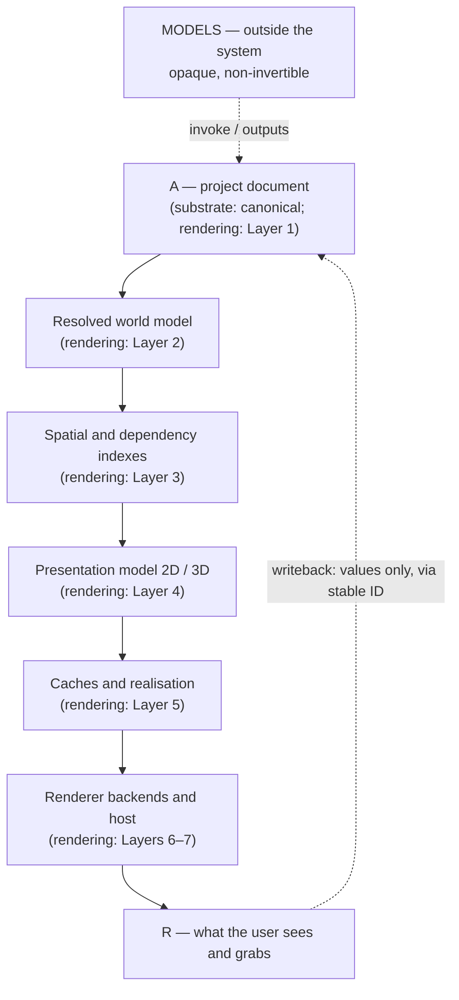

# Bridge: substrate and rendering layers

**Status:** Reconciliation note
**Date:** 2026-07-24
**Scope:** How *Model, projection, and bijective control* and *Layered architecture for a
2D/3D composition editor* relate. Intended as orientation for anyone — human or agent —
picking up both documents.

note from human that helped develop this plan: this document is almost entirely about the concept of "Projections" from the 02_substrate-model-projection-control document. This is because I'm mostly describing an injective document type that does not do computation (more like html than javascript). However, the key is that the DOM-like-content generated by the AI as described in this document is the thing that *calls out* to models running outside the program (or just in different threads or something)

---

## 1. What each document is about

The two documents describe **the same system from opposite ends**, and they barely
overlap in subject matter, which is why they are consistent.

| | Substrate document | Rendering-layers document |
|---|---|---|
| **Question** | What is the *content*, who may *edit* it, and how does it stay editable? | How does content become *pixels* without redundant work? |
| **Axis** | Authority and invertibility | Derivation and invalidation |
| **Central asset** | The parameter-leaf surface | The damage-bounded cache hierarchy |
| **Failure it prevents** | Edits that cannot be reversed or attributed | Frames that recompute what did not change |
| **Absent from it** | Rendering, caching, tiles, backends, memory policy | Language models, writeback, editor authoring, model call-outs |

Neither contradicts the other. Read together they cover authoring and presentation of one
pipeline.

---

## 2. The terminology collision — read this first

**The word "projection" means different things in the two documents.** This is the single
most likely source of confusion and should be normalised before either document is
extended.

- In the **substrate** document, *Projection* is an **ontological role**: the lossy,
  data-like layer that arranges, parameterises, and transforms the output of opaque
  Models into perceptible form. Its opposite is *Model*. It is about **what may be
  edited**.
- In the **rendering-layers** document, *presentation projection* is a **pipeline stage**:
  the renderer-neutral 2D and 3D drawing intent derived from the resolved world model. Its
  opposite is *document*. It is about **what may be discarded and rebuilt**.

They are not the same layer. A substrate-Projection is authored and edited; a
presentation-projection is derived and thrown away. In the substrate's vocabulary,
`Presentation2d` and `Presentation3d` are part of **R** — the runtime encoding — not part
of the projection layer at all.

**Suggested normalisation:** reserve *Projection* for the ontological sense and rename the
pipeline stage to **presentation model** or **draw intent** throughout the rendering
document. The ontological sense is load-bearing across the entire substrate argument and
cannot be renamed cheaply; the pipeline stage is a local name.

---

## 3. The correspondence

Once the naming is fixed, the layer mapping is clean:

| Substrate concept | Rendering-layers concept |
|---|---|
| **A**, the canonical document | Layer 1, the project document |
| **R**, the runtime encoding | Layers 2–7 collectively: resolved world, presentation, caches, backends |
| "R is canonical *by convention only*" | "Authoritative data separate from derived data"; derived caches "can be discarded and rebuilt" |
| Provenance node identity for writeback | "Stable document IDs that survive save/load, undo/redo, ECS remapping"; "entity IDs should not be the durable identity" |
| Reactive dirty-tracking over a signal graph | "Recompute by revision, never by habit"; property dependency graph; dirty queues |
| φ-versus-θ cost stratification (§6.4) | Damage bounds and spatial work-set narrowing |
| Fixed archetype gizmos as the interaction floor | "Renderers as backends" — a fixed, swappable implementation layer beneath neutral data |
| Annotation as the third ontological term | §10, pedagogy-specific composition: links, callouts, hotspots as first-class document data |

The strongest agreement is structural: **both documents independently insist that the
durable representation must be renderer-agnostic and identity-stable, and that everything
downstream is a rebuildable cache.** The substrate reaches this from invertibility (only a
canonical document can absorb writeback); the rendering document reaches it from
invalidation (only a canonical document can be diffed for damage). Same conclusion, two
proofs.

---

## 4. What each document supplies to the other

### 4.1 Substrate → rendering

**Annotation is not incidental — it is a first-class ontological layer.** The rendering
document already treats pedagogical links as document data, which is correct. The
substrate strengthens the reason: annotation is the *most bijective, most mouse-native*
layer, and for communication it carries most of the message. It deserves its own
invalidation and presentation path rather than being modelled as a special case of 2D
content.

**The document must hold model invocations, not just static values.** Layer 1's concept
list has no place for "this property is the output of an external simulation," and Layer
2's dependency evaluation assumes all inputs are local. Add an invocation node with a
cost annotation, and a rule that expensive invocations never participate in a frame-rate
dependency pass.

**Interaction has a latency floor that constrains layer placement.** Any operation inside
a continuous manipulation loop must be local and cheap. This is a hard constraint on where
the boundary between floor operations and call-outs falls, and it interacts directly with
the frame lifecycle: a drag must complete stages 2–7 within a frame, which means
θ-changes (expensive) and φ-changes (cheap) require *different* scheduling paths, not one
uniform pass.

**Editor surfaces are content, not chrome.** Timelines, node editors, and control panels
are document data bound to leaves, rendered by the same engine. The rendering document
already provides the right home for them — its "separate live overlay layer" for selection
handles and guides — but the substrate expands the requirement: these surfaces are
*authored*, *numerous*, and *change at interaction rate*. Overlay policy should be sized
for editor artifacts, not just for a handful of fixed gizmos.

**Two invariants belong in §12 of the rendering document.** No writeback without stable
provenance; and no editable handle bound to a derived value without an explicit
disambiguation policy.

### 4.2 Rendering → substrate

**Identity stability has an implementation, not just a rule.** The substrate insists node
identity must survive model edits and rebuilds but offers only "instruct the model, then
structurally diff." The rendering document's stable-ID discipline across save/load, undo,
and ECS remapping is the mechanism that makes that enforceable.

**The reactive graph needs revision stamps, not just dirty flags.** The substrate assumes
change detection suffices. At the document sizes the rendering document targets — tens of
thousands of primitives — revision stamps and deduplicated dirty queues are what keep
recomputation proportional to damage. The reactive system of substrate §4 should be
specified in those terms.

**Damage bounds are the missing half of writeback.** The substrate describes writeback as
a value flowing home. The rendering document supplies what must happen next: preserve the
old bounds, compute the new, union and inflate, invalidate intersecting cache entries.
Writeback is a *document mutation like any other* and must enter the same damage pipeline.

**Cost accounting for the manipulation loop.** The substrate argues the inner loop must
not cross a process boundary. The rendering document's per-stage instrumentation is how
that claim gets verified rather than assumed — and its warning that every full-scene
fallback must be instrumented "so it cannot become an invisible normal path" applies
verbatim to model call-outs sneaking into a drag loop.

---

## 5. Tensions to resolve

1. **Where the reactive interpreter lives.** The rendering document's Layer 2 evaluates
   inherited properties, transforms, animation samples, and link results — which is
   substantially the substrate's reactive system. Either they are one component or the
   duplication must be deliberate. Recommendation: they are one component; Layer 2 *is*
   the reactive interpreter, and the substrate's signal/derived/effect vocabulary is the
   specification for it.
2. **Crate boundaries do not yet have a home for the model layer.** The proposed package
   list has no equivalent of the floor library or the call-out dispatcher. Two boundaries
   are missing: a pure transform library, and an external-invocation service with caching
   and cost policy.
3. **Authoring surfaces are absent from the package list.** Nothing owns surface syntax,
   structural diffing, or the model-facing document API. If authoring happens outside the
   Rust process, that boundary should be named explicitly rather than left implicit.
4. **Benchmark fixtures are static.** The rendering document's Milestone 1 fixture is a
   large static document. It should also include reactive bindings, a repeated-structure
   node, an annotation set, and a simulated expensive invocation — otherwise the fixture
   validates rendering under conditions the real product will never be in.
5. **Undo across the writeback boundary.** The substrate produces edits from three sources
   — human manipulation, model edits, and value writeback from the runtime. The rendering
   document has undoable commands but does not contemplate mutations originating in the
   runtime. Writeback must produce commands, and model-inferred repairs must be a single
   reviewable, revertible unit.

---

## 6. The through-line

If a single sentence has to orient a reader across both documents:

> **One identity-stable, renderer-neutral document holds all authored intent; everything
> downstream of it — resolved values, draw intent, caches, pixels — is derived and
> rebuildable; everything opaque and expensive — the science itself — is exiled outside
> and reached only through invocation; and the only things a mouse may grab are the leaves
> of that document.**

The rendering document is the theory of *derived and rebuildable*. The substrate document
is the theory of *authored intent* and *what a mouse may grab*. The shared premise is the
canonical document in the middle, and neither theory works without it.