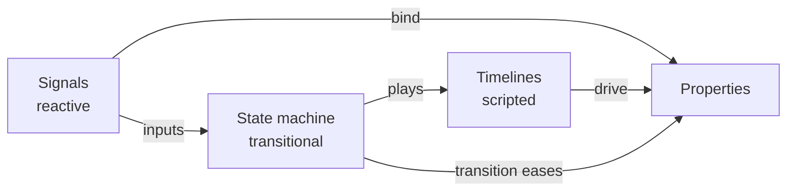

# Three kinds of time

**Status:** Vision draft
**Date:** 2026-08-31
**Scope:** A scope boundary on the temporal vocabulary of
`04_architecture-an-llm-editable-scene-document.md` §6.5, the storage question it
leaves open, and the authoring surfaces that keep the three kinds distinct
without making a user learn three mental models.

---

## 1. The pressure this document exists to resist

§6.5 gives the timeline a flex vocabulary — `<seq>`, `<par>`, `dur`, `grow`,
`min`/`max` — and §4.2 argues it is the *same* solver on the time axis. Both are
right: a flex solver is a 1D distribution per axis — a fixed basis, a growth
factor and a gap — and nothing in that calculation knows whether its unit is a
pixel or a second.

But `<seq>`/`<par>` describes exactly one kind of time-varying behaviour, and it
will be under constant pressure to absorb two others, because it will be the
mechanism that exists first. That absorption is cheap at every individual step
and expensive in aggregate: it ends with zero-duration clips acting as event
handlers, clips whose endpoints are expressions, and a timeline editor that can
no longer draw its own document.

This document names the three kinds so the boundary can be defended
deliberately rather than eroded one reasonable feature at a time.

---

## 2. The three kinds

| | **Scripted** | **Reactive** | **Transitional** |
|---|---|---|---|
| Question it answers | *When* does this happen? | *What* is this value right now? | *What* should happen when state changes? |
| Example | intro, then body, then finale | a bar's height tracks signal `X` | selection eases to the highlight style |
| Driven by | playhead position | dependency graph | state entry/exit |
| Has a start and duration? | yes | no | duration yes, start no |
| Lives on a track? | yes | no | no |
| Authored where | timeline tree (§6.5) | binding on a property | state machine (§5.3) |
| Editable how | drag an interval | edit an expression | drag a transition edge |

The rows that matter most are the last three. **A reactive binding has no
position on a track**, so it cannot be rendered in a timeline editor without
inventing a fake extent for it. **A transition has a duration but no start**,
because its start is an event, not a clock reading. Force either into
`<seq>`/`<par>` and the interval-dragging archetype of §9.3 stops working, which
takes the timeline editor with it.

### 2.1 The concrete failure

`<clip from="1" to="0">` has literal endpoints. The moment someone needs
`to="{{signal.threshold}}"`, the clip's extent is no longer statically known.
The clip can still be *evaluated*, so nothing breaks at runtime — which is
exactly why this change looks harmless. What breaks is authoring: the editor can
no longer draw the interval's value curve, and "drag this keyframe" no longer has
a well-defined result.

**Proposed rule: clip endpoints stay literal.** A value that must track a signal
is a reactive binding on the property, not a clip. If a scripted animation needs
to end at a data-dependent value, it animates a *normalised* parameter (0→1) and
a reactive binding maps that parameter to the data-dependent range. The two kinds
compose without either absorbing the other.

---

## 3. `target` is a projection of an edge

§6.5 writes `<clip target="#a91f" prop="opacity" from="1" to="0"/>`, which reads
as though `target` were a property of the clip. §7 says non-containment edges are
first-class, stored as `Relation { from, to, rel, data }`. These are compatible,
but only under one reading, and it should be stated rather than inferred:

> **The relation is the storage. `target="#a91f"` is how that relation is
> rendered into the tree projection for a reader.**

This is the same discipline as *read markup, write ops* (§0.6): the XML is a
view, never the store. A reader sees the edge inlined on the clip because that is
where it is legible; the store holds it in the relation table, indexed both ways.

The distinction is not cosmetic. It decides four behaviours:

| | `target` as a **prop** | `target` as an **edge** |
|---|---|---|
| "What animates this node?" | scan every clip | reverse index lookup |
| Deleting the target | clip silently points at nothing | referrer list exists; can warn or cascade |
| One clip, many targets | needs a string list and a parser | N edges from one clip, natively |
| Per-target offset (stagger) | needs a DSL in the attribute | `data: { offset }` on each edge |

The last two are what make the edge model earn its cost. A staggered entrance —
twenty grid lines fading in 30 ms apart — is **one clip with twenty edges**, each
carrying its own offset in the edge's `data`. As a property it is either twenty
near-identical clips or an invented mini-language inside an attribute, which §7
explicitly forbids:

```xml
<node blink="#spinner.spin+10s"/>     <!-- §7: not this -->
```

So the projection of a multi-target clip should degrade honestly rather than
inventing syntax — a count plus samples, in the elision style of §6.3:

```xml
<clip id="#grid_in" prop="opacity" from="0" to="1" dur="0.4s"
      targets="20" stagger="0.03s" elided>
  <target ref="#gl_01" offset="0s"/>
  <target ref="#gl_02" offset="0.03s"/>
</clip>
```

### 3.1 The index this requires

Add to §2.6:

| Index | Purpose |
|---|---|
| `byTarget: Map<NodeId, Set<RelationId>>` | "what drives this node" — the reverse direction |

This index is not only an optimisation. It is the data behind the single most
useful piece of UX in the whole system, described in §5.3.

---

## 4. Components own all three

A component is where the three kinds meet, and it is the case that most tests
whether the separation is real. Take an XY-graph component whose grid lines
animate into view on first display.

```xml
<component name="xy-graph">
  <param name="data"/>
  <param name="enter-dur" default="0.4s"/>

  <body>
    <col>
      <axis id="ax"/>
      <gridlines id="grid" count="{{$data.gridlines}}"/>
      <series id="s" points="{{$data.points}}"/>
    </col>
  </body>

  <state name="phase" initial="hidden"/>

  <timeline name="enter" dur="{{$enter-dur}}">
    <par>
      <clip target="grid" prop="opacity" from="0" to="1" stagger="0.03s"/>
      <clip target="ax"   prop="opacity" from="0" to="1"/>
    </par>
    <clip target="s" prop="draw" from="0" to="1"/>
  </timeline>

  <machine>
    <transition from="hidden" to="shown" on="mount" play="enter"/>
  </machine>
</component>
```

Four mechanics this requires, none of which are free:

**Targets inside a definition are definition-local.** `target="grid"` names a node
in the *body*, not a NodeId. Instantiate the component ten times and each instance
resolves that reference to its own grid node. So a component's edges are
**templates**, and instantiation mints concrete edges between concrete NodeIds.
Those edges are *derived*, exactly like the expanded body, and belong in the
derived side table rather than the authored document.

**Named timelines are part of the component's interface**, alongside params. That
is what lets a parent schedule a child's animation without reaching inside it:

```xml
<seq>
  <clip dur="2s"/>
  <play target="#graph1" timeline="enter"/>
</seq>
```

`<play>` is a clip whose duration is *derived* from the referenced timeline —
which means a component's animation composes into a parent sequence the same way
its layout composes into a parent row. Without this, the only options are "the
component animates itself whenever it feels like it" or "the parent reaches
inside and drives the component's internals," and the second breaks encapsulation
irreparably.

**Local state is required, not optional.** `phase: hidden | shown` is §5.3's
`local_state`. Without it there is nowhere to record that the flourish has
already played, and the component either replays on every re-evaluation or needs
the parent to remember on its behalf.

**All three kinds appear in one component.** The layout is containment, the
flourish is scripted, the mount trigger is transitional, and `count="{{$data.gridlines}}"`
is reactive. This is the normal case, not an exotic one — which is the strongest
argument for keeping the three mechanisms distinct and composable rather than
merging them.

---

## 5. Authoring surfaces

### 5.1 On Rive's answer

Rive's durable idea is **two surfaces with a clean division of labour**:
timelines describe *what an animation looks like*; a state machine describes
*when it plays*, with declared inputs as its interface. That division is correct
and should be adopted. Splitting "shape" from "trigger" is what stops a timeline
from accumulating event-handling responsibilities.

Where Iron differs is that it has a **first-class signal graph inside the
document**, which a timeline-plus-state-machine tool does not. So Iron has a
third authoring need Rive's two surfaces do not cover, and the temptation will be
to route reactive behaviour through the state machine as a large number of
threshold-triggered states. That works for a handful and collapses past it.

The recommendation is Rive's two surfaces plus a third, with one wire added:
**signals may be inputs to the state machine**, so the reactive layer *feeds* the
transitional layer instead of competing with it.



### 5.2 Property-first, not mechanism-first

The discontinuity between the three kinds is smoothed by never asking a user to
pick a *mechanism*. They pick a **property** and say how it should behave.

Every property row in the inspector carries a mode control:

```
opacity   [ const | bound | animated ]   1.0
```

- `const` — a literal. The default.
- `bound` — opens an expression/pick-a-signal affordance.
- `animated` — adds the property to the timeline and reveals a track.

This generalises After Effects' stopwatch, which is the best-known solution to
the const→animated transition, and which fails mainly by being a tiny icon whose
state is easy to miss. Making the mode an always-visible three-way control fixes
that and extends it to the reactive case, which AE has no equivalent for.

**Corollary: never silently create a keyframe.** Moving an object while the
playhead is off zero must do what the mode says, and the mode must be visible
while you are doing it. Silent keyframe creation is the single most common source
of "why is my animation broken" in timeline tools.

### 5.3 The "why is this moving?" probe

Select anything, ask what drives it, get an answer that names the kind and jumps
to the surface that authors it:

```
#gl_07  opacity
  ← scripted      #grid_in  in timeline "enter"  (t 0.21–0.61s)   [open timeline]
  ← transitional  machine "phase": hidden → shown                 [open machine]
#gl_07  y
  ← reactive      bound to  data.gridlines[6].value               [open binding]
```

This is the `byTarget` index of §3.1 rendered as UI, and it is the main thing
that makes three mechanisms tolerable instead of confusing. Without it a user
facing unexpected motion has to guess which of three surfaces to open. Note it
also answers the *no-motion* case — "nothing drives this" is a useful answer, and
only a reverse index can give it.

### 5.4 A manifest for the model

The model faces the same three-way choice and should not infer it. §6.6 already
establishes the pattern; the temporal equivalent is a table in the system prompt:

```
TIME
  scripted      fixed schedule, has start + duration, lives on a track
                verbs: seq/par/clip, play(component, timeline)
                use when: "then", "after", "for 2 seconds"
  reactive      value follows other values; no start, no duration
                verbs: bind(node, prop, expr)
                use when: "tracks", "always shows", "proportional to"
  transitional  fires on state change; duration but no start
                verbs: state, transition(from, to, on, play)
                use when: "when", "on hover", "once loaded"
```

The "use when" column is doing the real work: it maps the natural-language cues
a user actually types onto the mechanism, so selection is lookup rather than
inference. The same table is what §5.2's mode control is named after, so a user
and the model describe a change in the same words.

### 5.5 A read-only track for the other two

The timeline panel should show reactive and transitional activity as
**non-draggable tracks** beneath the scripted ones — a signal's value as a
sparkline, a state machine's active state as a band. They are derived, so they
cannot be edited there, and the UI must make that obvious rather than merely
true. The purpose is diagnostic: motion whose cause is not a keyframe is
otherwise invisible on the surface where a user is most likely looking for it.

---

## 6. What this asks of the rest of the architecture

| Requirement | Section it touches |
|---|---|
| Relations are the storage; `target` attributes are projections | §7, §6.5 |
| `byTarget` reverse index | §2.6 |
| Tombstones must cover animation targets, not just semantic links | §2.4 |
| Component definitions hold template edges; instantiation mints concrete ones | §5.3 (doc 02) |
| Named timelines are part of a component's declared interface | §5.3 (doc 02) |
| Clip endpoints stay literal; data-dependence goes through a bound parameter | new |
| Signals may be state-machine inputs | new |

Nothing here contradicts the existing documents. The two additions are the
literal-endpoints rule, which is a scope boundary rather than a mechanism, and
the signal→state-machine wire, which is the one piece Rive's model does not
supply because it has no document-internal signal graph to supply it from.
