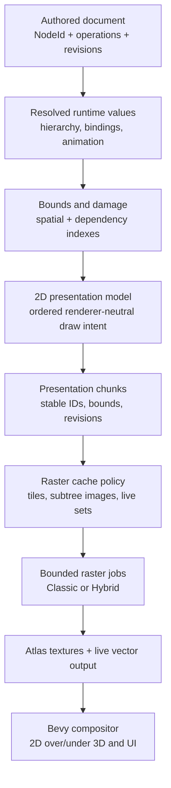

# Current 2D backends and a high-performance hybrid architecture

**Status:** Current-state record and architectural direction
**Date:** 2026-09-04
**Scope:** What the classic Vello and Vello Hybrid backends in Iron do today,
what the performance comparison establishes, and how a production 2D system
using Vello Hybrid would likely need to group, invalidate, rasterize, cache, and
compose content.

This document connects the renderer work to the rest of the vision set. It uses
**Projection** in the ontological sense established by
[`02_substrate-model-projection-control.md`](02_substrate-model-projection-control.md).
The renderer-neutral runtime drawing data is called **draw intent** or the
**presentation model**, following the terminology correction in
[`03_bridge-substrate-and-rendering-layers.md`](03_bridge-substrate-and-rendering-layers.md).

The short conclusion is:

> Classic Vello is currently the stronger live, changing-scene renderer. Vello
> Hybrid has the better startup behavior on the affected Windows/NVIDIA path,
> but its current full-view integration is only fast when the complete scene is
> clean. A performant hybrid-backed system should use Hybrid primarily to
> rasterize bounded cache misses, then let Bevy composite retained textures.

“Hybrid-backed” therefore should not mean “keep the entire document in one
`vello_hybrid::Scene` and render it every frame.” It should mean “Hybrid is the
vector rasterizer behind a damage-bounded retained image system.”

---

## 1. How this fits the vision architecture

The six preceding documents converge on several constraints that apply directly
to rendering:

1. The authoritative document is identity-stable, renderer-neutral authored
   data. Renderer scenes, bounds, tiles, and textures are derived and
   disposable.
2. Every mutation is a semantic operation and produces revisions. Rendering
   consumes revisions rather than rediscovering change by traversing the whole
   document every frame.
3. Continuous manipulation stays local. It cannot cross the model-call boundary
   and it cannot trigger work proportional to the entire document.
4. Old and new visual bounds turn a mutation into spatial damage. A spatial
   index turns damage into a bounded presentation and raster workload.
5. Scripted, reactive, and transitional time are distinct authoring mechanisms,
   but all three eventually produce the same rendering facts: which draw-intent
   chunks changed, which bounds moved, and which cache entries are stale.
6. Clean derived work is reused. The same principle governs both LLM context and
   pixels: laziness and bounded invalidation beat repeatedly reconstructing a
   complete derived view.

This gives the 2D pipeline a precise place in the larger system:



Renderer selection occurs near the bottom. It must not determine document
identity, grouping semantics, undo, dependency resolution, or damage.

---

## 2. What exists today

### 2.1 The renderer-neutral seam

Application drawing systems emit `DisplayList` components on `VectorLayer`
entities. A list is an ordered stream of:

- solid fills;
- solid strokes;
- scoped clips;
- retained concrete shape kinds: rectangle, rounded rectangle, circle, line,
  and Bézier path.

Keeping shape kinds intact matters because both backends have specialized fast
paths. The current seam does not yet represent gradients, images, glyph runs,
blend groups, masks, or filters.

`DisplayList::rebuild` records into a scratch buffer and compares the new command
stream with the previous one. The Bevy component is marked changed only when the
contents differ. This has two useful effects:

- an app system may rebuild declaratively without forcing backend work when the
  result is byte-identical;
- an idle frame performs no backend encoding.

This is valuable retention, but it is content comparison rather than the future
revision-and-damage system. Building and comparing a 25,000-shape list still
costs about 1.3–1.5 ms per frame on the measured M5, even when the result is
unchanged.

`VectorLayer` currently supplies two additional facts:

- `LayerSpace::Screen` or `LayerSpace::World`;
- an explicit integer painter order.

Both backends are compiled into one wasm artifact and consume the same display
lists, but the normal app initializes only one of them. Hybrid is the default.
F9 restarts into an explicit `?bevy=classic` variant, deferring all classic
renderer and compute-pipeline creation until the user requests it. The perf
fixture deliberately initializes both for runtime A/B switching. Hybrid's
offscreen image also carries no initialized CPU pixel buffer: the renderer
clears the complete target itself, so prefilling and uploading zeros would be
redundant.

### 2.2 Classic Vello today

The classic path is implemented through `bevy_vello`:

- each `VectorLayer` receives its own `VelloScene2d`;
- only changed display lists are replayed into their corresponding scenes;
- the encoding remains resolution-independent;
- path flattening and raster work happen on the GPU, including compute shaders;
- transforms can be applied around retained per-layer scenes;
- `bevy_vello` owns extraction, rendering, and final composition.

The important performance property is **per-layer incremental encoding**. With
16 evenly sized layers, changing one shape in a 25,000-shape fixture caused
classic to emit roughly one sixteenth of the commands, not the complete scene.

Classic still has repeated GPU work when the application submits a complete
full-view scene. Retaining the CPU-side encoding is not the same as retaining
pixels. A raster cache would benefit classic too, especially for large static
documents.

### 2.3 Vello Hybrid today

The Hybrid path uses `vello_hybrid` 0.2 directly in Bevy's render world:

- changed display-list layers are deep-cloned into a retained render-world
  mirror;
- world-space transforms and the camera mapping are resolved into device space;
- all visible layers are sorted by painter order and merged into one
  pixel-sized `vello_hybrid::Scene`;
- Hybrid flattens paths, tiles them, and computes antialiasing coverage on the
  CPU;
- vertex and fragment passes paint the result into a full-window offscreen
  texture;
- a custom Bevy material composites that premultiplied texture correctly.

The custom composite is correctness-critical. Hybrid writes premultiplied,
sRGB-encoded color. Sampling it as an ordinary sRGB sprite and then applying
straight-alpha blending darkens partial-coverage pixels. The current compositor
samples an UNORM texture, un-premultiplies, converts color space, re-premultiplies,
and uses premultiplied blending.

The render-world mirror is genuinely retained: unchanged layers are not cloned
again. The `Scene` is also retained when nothing changes. The limitation appears
when anything does change:

1. `prepare_scene` calls `reset_and_resize` on the one merged scene.
2. It walks every visible extracted layer in painter order.
3. It re-emits every command in those layers.
4. Hybrid regenerates device-space strips and coverage for the complete scene.

The current public `Scene` API has no partial replacement operation. Layer-level
change detection therefore has a binary effect for Hybrid: it distinguishes
“nothing changed” from “something changed,” but it does not make a dirty frame's
encode cost proportional to the changed layers.

Hybrid also calls its render path every active frame. Even with a clean retained
scene, current upstream behavior rebuilds schedules and uploads coverage/paint/
strip data. That produces a scene-size-dependent idle floor.

### 2.4 What both paths already get right

- The application-side drawing vocabulary does not contain renderer scene
  types.
- Idle content comparison prevents unchanged display lists from dirtying either
  backend.
- Painter order is explicit.
- Whole-layer viewport culling exists in Hybrid.
- The Hybrid output owns a render target instead of clearing Bevy's populated
  view target.

These are useful foundations. They are not yet the damage and raster-cache
architecture described below.

---

## 3. What the measurements establish

The figures below were captured with the temporary comparison harness that was
removed after it answered the backend-selection question. They remain here as
architectural context rather than as a maintained benchmark facility.

### 3.1 Startup and throughput have different winners

On the Windows/RTX 4080 machine that reproduces Vello issue #936, the earlier
cold-start harness measured:

| Metric | Classic | Hybrid |
|---|---:|---:|
| Time to first frame | 60 ms | 152 ms |
| Worst startup frame gap | 1,370 ms | 281 ms |

Hybrid does more CPU work before its first frame, but it avoids classic's much
larger compute-shader compilation stall. On that hardware, eliminating the
1.37-second gap is the reason to pursue Hybrid.

Steady-state throughput points the other way. On an Apple M5 MacBook Air,
Chrome 152, a 1600×1000 release/SIMD run with 16 layers measured:

| Workload | Classic tick / fps | Hybrid tick / fps |
|---|---:|---:|
| 5k shapes, edit 1 | 3.6 ms / 60 | 9.3 ms / 60 |
| 10k shapes, edit 1 | 3.6 ms / 60 | 16.3 ms / 53 |
| 25k shapes, edit 1 | 5.5 ms / 60 | 38.9 ms / 26 |
| 25k shapes, full pan invalidation | 9.6 ms / 60 | 36.4 ms / 27 |
| 25k shapes, idle | 3.5 ms / 60 | 5.5 ms / 60 |

The 60 fps readings are vsync-capped; tick duration expresses the remaining
headroom. Classic is not proven to top out at 60 fps. It is proven to fit within
the frame budget in these cells.

### 3.2 Hybrid scales with dirty scenes, not dirty shapes

Hybrid encode time was almost invariant as edit churn rose from one to one
hundred shapes:

| Total shapes | Edit 1 | Edit 100 |
|---:|---:|---:|
| 5k | 6.17 ms | 6.18 ms |
| 10k | 11.99 ms | 12.10 ms |
| 25k | 31.90 ms | 29.51 ms |

At 25k/edit-one, classic emitted about 1,548 commands while Hybrid emitted about
24,468. The one changed layer helps classic; it only sets the global dirty bit
for Hybrid.

This corrects the attractive but false statement that current Hybrid cost is
proportional to changed shapes. It is proportional to total visible content
after the scene crosses from clean to dirty.

### 3.3 More layers help classic but barely help Hybrid

At 25k shapes with ten scattered edits:

| Layers | Classic tick / encode | Hybrid tick / encode |
|---:|---:|---:|
| 1 | 9.4 / 6.14 ms | 39.8 / 32.00 ms |
| 16 | 7.8 / 3.94 ms | 39.3 / 31.93 ms |
| 64 | 5.7 / 1.09 ms | 38.0 / 30.85 ms |

Layer subdivision is already an effective classic optimization. It cannot solve
Hybrid's merged-scene rebuild by itself.

### 3.4 Corrected pan behaves like full invalidation

The first full sweep accidentally moved about half the shapes outside the
viewport during pan, making Hybrid appear roughly twice as fast as it was. The
fixture now wraps positions into the viewport. The corrected 25k Hybrid pan
encode is 29.57 ms, essentially the same as edit-100 at 29.51 ms, and it runs at
about 27 fps.

This is the expected result for the current integration and a direct argument
for world-anchored cached tiles: a pan should move retained images and rasterize
only newly exposed edges, not rebuild a full device-space vector scene.

### 3.5 The useful crossover is a workload bound, not a product constant

On this M5, a dirty Hybrid full-view scene is comfortable around 5k shapes and
crosses the 60 fps boundary around 10k. That is not a permanent “5,000 shapes”
product limit. Shape kind, path complexity, covered pixels, clips, effects,
device balance, browser, and SIMD support all move it.

The architectural lesson is stable even when the number moves:

> Bound the amount of Hybrid work in any one raster job and in any one frame.

---

## 4. Three different meanings of grouping

A high-performance design needs three group concepts. They may occasionally
share boundaries, but they must not be the same type by accident.

### 4.1 Authoring groups

These are stable document nodes: components, semantic subtrees, panels, chart
parts, annotations, or user-created groups. They exist because the content has
meaning and because humans and models edit it as a unit.

An authoring group supplies useful hints—stable identity, hierarchy, isolation,
and revision history—but it is not automatically a good raster unit. A semantic
group may cover the whole canvas or contain a mixture of static and animated
children.

### 4.2 Presentation chunks

A presentation chunk is a derived, renderer-neutral, contiguous span of draw
intent with:

- a stable derived ID tied back to source `NodeId`s;
- explicit painter-order range;
- conservative visual bounds;
- content and resource revision stamps;
- transform and effect dependencies;
- measured command count and rebuild cost;
- invalidation frequency.

Chunks are the unit of draw-intent regeneration and dependency tracking. They
replace “rebuild and compare every layer every frame” with “rebuild only chunks
whose source revisions advanced.”

Good chunk boundaries tend to have:

- similar change cadence among their contents;
- spatial locality;
- stable painter-order contiguity;
- a closed clip/blend/filter context;
- shared resource dependencies;
- a bounded command and covered-area cost.

Bad boundaries put one animated cursor inside a huge static chart, split every
tiny primitive into its own scheduling object, or cross a compositing operation
whose semantics require an isolated surface.

### 4.3 Raster cache entries

Raster entries are backend-specific derived images. The main forms should be:

1. **World-space tiles** at discrete zoom buckets. These make local damage and
   pan bounded.
2. **Isolated subtree images** for complex, mostly static compositing groups
   whose effects or structure make ordinary tiling inefficient.
3. **Transient gesture proxies** reused under a temporary transform while exact
   content is refined.

One presentation chunk may contribute to several tiles. One tile may contain
commands from several chunks. An isolated subtree image may cover multiple tiles
when flattening that subtree is semantically correct and cheaper.

This many-to-many relationship is essential. Equating a `VectorLayer` with a
tile either rerasterizes enormous areas after local edits or creates so many
layers that scheduling and composition dominate.

---

## 5. The proposed hybrid-backed rendering loop

### 5.1 Mutations produce revisions and damage

When a visual node changes:

1. Preserve its previous conservative visual bounds.
2. Resolve the new authored and derived values.
3. Compute new bounds, including stroke, antialiasing fringe, shadow, blur,
   filter, and other effect outsets.
4. Union old and new bounds.
5. Propagate invalidation only through declared dependencies.
6. Mark intersecting presentation chunks and raster entries dirty.

Deleting and moving require old bounds; using only the new location leaves
stale pixels behind. Reparenting also changes painter context and may invalidate
both the old and new compositing groups even when geometry is unchanged.

The document operation log should be the source of the dirty queue. Bevy change
detection can help realize revisions, but it should not be the authoritative
definition of what changed.

### 5.2 Realize only dirty draw-intent chunks

For each dirty chunk:

- resolve its ordered primitives from the presentation model;
- update its bounds and resource dependencies;
- update its entry in the 2D spatial index;
- retain its command stream until that chunk changes again.

Clean chunks are not traversed. Hash comparison can remain as a debug assertion
or compatibility bridge, but known document revisions should eventually make
full command-by-command comparison unnecessary on normal frames.

### 5.3 Turn damage into dirty tiles

Tiles should be anchored in world coordinates and keyed by a discrete zoom
bucket. For each damage rectangle:

1. Choose affected tile coordinates at the active bucket.
2. Inflate for a sampling gutter so antialiasing and filters do not seam at tile
   edges.
3. Query the spatial index for all draw-intent chunks intersecting each tile.
4. Recover the complete painter-ordered primitive list for that tile.
5. Schedule a bounded raster job.

A changed primitive cannot simply be drawn over an old tile. If it sits between
unchanged primitives in painter order, doing so changes the image. The dirty tile
must be regenerated from every intersecting primitive in correct order.

### 5.4 Use Hybrid as a bounded rasterizer

For each dirty tile or small compatible tile batch:

1. Create or reset a scene sized to the bounded raster target, not the complete
   window.
2. Transform intersecting commands into tile-local device coordinates.
3. Clip to the tile plus gutter.
4. Let Hybrid flatten, tile, and generate coverage for that bounded command set.
5. Render into a temporary texture or an atlas-compatible target.
6. Publish the completed raster entry atomically.
7. Reuse its pixels until its cache key becomes stale.

The exact atlas-write mechanism must be validated against the upstream render
API. The ownership rule does not depend on that detail: a Hybrid scene is a
short-lived realization of one bounded dirty region, not the retained document.

Tile size is a measured parameter. Small tiles reduce edit damage but increase
gutter waste, job count, atlas fragmentation, and composite draws. Large tiles
do the opposite. Reasonable candidates such as 256 and 512 physical pixels
should be benchmarked with actual path density and effects rather than selected
by convention.

### 5.5 Composite clean pixels cheaply

The normal frame should submit cached image instances, not vector commands:

- batch or instance atlas quads;
- preserve premultiplied-alpha and color-space correctness from the current
  Hybrid compositor;
- apply camera translation at composition time;
- avoid uploads when tile texture content and instance data are unchanged;
- keep the 2D result composable above or below Bevy 3D viewports and UI.

Clean cached content invokes neither classic Vello nor Vello Hybrid. Backend
choice matters only on cache misses and for deliberately live content.

---

## 6. Pan, zoom, editing, and animation

### 6.1 Pan

At a fixed zoom bucket, panning changes tile placement and visibility, not tile
contents:

- composite existing world-space tiles at the new camera transform;
- request tiles only for newly exposed regions;
- prioritize the leading edge of motion;
- retain a small offscreen margin to absorb short pans without raster work.

Fractional screen translation may use texture filtering at composition time. It
does not justify regenerating Hybrid coverage for every shape every frame.

### 6.2 Zoom

Hybrid's strips and coverage are device-space, so exact output is zoom-dependent.
Continuous zoom should therefore use progressive refinement:

1. Transform the nearest cached zoom bucket as a temporary proxy.
2. Choose a new discrete bucket only after crossing a quality threshold.
3. Rasterize visible tiles at the new bucket in priority order, usually from the
   pointer or viewport center outward.
4. Replace proxies as exact tiles arrive.
5. Retain a limited number of adjacent buckets and evict by policy.

The proxy may soften briefly. That is preferable to blocking interaction on a
full-view CPU rebuild.

### 6.3 Local edits

A local geometry or style edit should dirty only tiles intersecting the union of
old and new visual bounds. If the edit is previewed continuously, the system may:

- keep the changing object and cheap local context in a live overlay;
- hide or mask its stale contribution in cached tiles when correctness requires;
- rerasterize bounded tiles at a controlled cadence;
- commit exact tiles when the gesture ends.

Whether an overlay is valid depends on painter order. Selection handles and
guides are naturally topmost; an ordinary object embedded in the stack is not.
The cache system must never trade ordering correctness for a cheap preview
without making that approximation explicit.

### 6.4 Rigid motion of a group

If a group is already raster-isolated and its internal content is unchanged, a
rigid translation, rotation, or temporary scale can move its cached image during
the gesture. Exact rerasterization is needed when resolution, clipping, or
effects demand it, but not necessarily on every intermediate pointer event.

This is where authoring groups can become useful cache hints: component instances,
chart subassemblies, and imported artwork often move as coherent units.

### 6.5 Scripted, reactive, and transitional motion

The three time mechanisms remain separate in authored data. Rendering classifies
their output by visual behavior instead:

- static or rarely changed content is raster-cached;
- rigidly moving isolated content reuses a cached image under a transform;
- small continuously changing geometry remains live or dirties a bounded tile;
- large deforming regions consume an explicit quality/work budget;
- state-transition effects may use a pair of cached endpoints plus a composite
  interpolation when visually valid.

The reverse “why is this moving?” index described in
[`05_three-kinds-of-time.md`](05_three-kinds-of-time.md) can also explain cache
pressure: it identifies which binding, timeline, or state transition is keeping
a chunk live.

---

## 7. Rasterizing groups safely

Subtree rasterization is powerful but changes compositing boundaries. A group
may be flattened into one image only when its interaction with surrounding
content is understood.

### 7.1 Good subtree-image candidates

- imported illustrations or diagrams that change rarely;
- complex chart backgrounds under a small live data overlay;
- component instances with an explicit isolated compositing boundary;
- deep clip stacks whose result is reused many times;
- command-heavy groups with compact bounds and low invalidation frequency;
- repeated instances whose raster result and scale bucket can be shared.

### 7.2 Poor candidates

- a group spanning most of the document when only one child changes often;
- content interleaved in painter order with nodes outside the group;
- backdrop-dependent blending or filters without an isolated surface;
- high-frequency deforming animation;
- a huge mostly empty bound;
- text or thin vector detail expected to remain crisp across a wide scale range.

### 7.3 Compositing barriers

Clips, masks, opacity groups, blend modes, filters, and backdrop effects must be
classified in the presentation model. Some create a natural isolated surface;
some require neighboring backdrop pixels; some need an expanded offscreen
region; some prevent a subtree from being cached independently.

The future display-list vocabulary should express these operations explicitly.
Raster policy cannot infer correct isolation from a flat stream of fills and
clip pushes after the fact.

### 7.4 Promotion should be measured

The current Hybrid statistics already point toward a useful policy: command
count, bounds/covered area, rebuild count, encode time, and reuse count. A cache
manager can estimate:

```text
benefit ≈ avoided_raster_cost × expected_reuses
          − composite_cost
          − memory_cost
          − expected_invalidation_cost
```

Promotion and demotion should use hysteresis so a group near a threshold does
not alternate representations every frame. Explicit author hints may exist, but
correctness and budgets remain system-owned.

---

## 8. Cache keys, scheduling, and memory

### 8.1 Cache identity

A raster entry should be keyed by all inputs that alter its pixels, including:

- stable chunk/subtree identity and content revision;
- resource revisions for images, glyphs, and paints;
- zoom bucket and device-pixel ratio;
- raster transform class when coverage depends on it;
- clip/effect revision and required gutter;
- output format, color space, and antialiasing mode.

Camera translation should usually not be in a world-tile key. Putting it there
would turn every pan into total invalidation.

### 8.2 Work queues

Raster misses must be scheduled, not all executed immediately. A priority queue
should favor:

1. visible damaged tiles under the pointer or active edit;
2. visible tiles near the viewport center;
3. newly exposed pan edges;
4. next-bucket zoom refinement;
5. offscreen margin and speculative work.

Each frame receives a CPU preparation budget, upload budget, and GPU submission
budget. Work that does not fit rolls forward while proxies remain visible. On
WASM, threaded CPU preparation may be unavailable or deployment-dependent, so
the single-threaded budget must be viable by itself.

### 8.3 Memory policy

The cache manager, not the renderer, owns memory limits. It should report and
budget at least:

- atlas allocations and fragmentation;
- subtree textures;
- zoom buckets;
- retained draw-intent command storage;
- glyph/image resources;
- transient render targets and effect surfaces.

Eviction should consider recency, rebuild cost, visibility, zoom distance, and
shared-instance count. A cheap old tile can be discarded before an expensive
subtree image likely to be reused.

---

## 9. Whether to mix backends

The architecture should continue to permit both backends behind the same bounded
raster interface.

| Work | Likely best path |
|---|---|
| Clean cached document content | Neither; composite textures |
| Dirty bounded tile | Benchmark Classic and Hybrid |
| Large changing full-view vector scene | Classic today |
| Small live overlay | Whichever has the lower integrated cost |
| Affected browser cold start | Hybrid avoids classic compute compilation |
| Static complex isolated subtree | Hybrid raster once, then cache |

There is an important product choice hidden here. Initializing classic for a
small overlay may reintroduce the Windows compute-shader startup stall that
motivated Hybrid. On affected hardware, a pure Hybrid mode should keep live
vector workloads deliberately small and use raster proxies aggressively. On
platforms where classic startup is acceptable—or after classic is already
warm—a mixed mode may deliver the best throughput.

This should be a capability and workload decision, not a document-format fork.
The same presentation chunks, damage, tiles, and atlas entries should survive a
backend change.

---

## 10. A concrete evolution from the current code

### Stage 1 — explicit chunk identity and revisions

- Give derived presentation chunks stable IDs tied to document `NodeId`s.
- Track content, transform, style, effect, and resource revisions.
- Store old/new conservative bounds.
- Replace unconditional display-list reconstruction with revision-driven dirty
  queues where the authoritative document exists.
- Keep command comparison temporarily as a validation mechanism.

### Stage 2 — spatial damage and painter-order queries

- Build the 2D spatial index over chunk bounds.
- Convert edits, deletes, reparenting, and resource changes into damage regions.
- Query all contributors to a dirty region and restore painter order cheaply.
- Add explicit compositing/isolation operations to draw intent.

### Stage 3 — compositor and atlas before backend specialization

- Introduce world-tile and subtree-image cache entries.
- Batch atlas quads in Bevy.
- Implement pan reuse, zoom proxies, gutters, memory accounting, and eviction.
- Validate alpha/color correctness against the current full-window composite.

Following the earlier vision recommendation, classic can be the first rasterizer
used to prove cache correctness. This separates ordering and invalidation bugs
from Hybrid integration bugs.

### Stage 4 — bounded Hybrid raster jobs

- Generalize the current full-window Hybrid target into bounded raster targets.
- Reuse renderer resources and scratch allocations across jobs.
- Build/reset a scene per dirty tile or compatible batch.
- Publish rendered atlas entries and skip Hybrid entirely for clean entries.
- Instrument encode, schedule, uploads, GPU time, and bytes per job.

The current `emit_layer` function is a useful command-emission seam, but cache
policy should move above it. The layer entity does not contain enough spatial or
compositing information to be the only cache unit.

### Stage 5 — live content and adaptive policy

- Separate topmost editor overlays from painter-embedded document content.
- Reuse isolated images under rigid gesture transforms.
- Add promotion/demotion policy driven by observed reuse and raster cost.
- Optionally select classic or Hybrid per bounded job on platforms where both
  are acceptable.

### Stage 6 — representative acceptance workload

Extend the benchmark beyond uniform shapes to include:

- clustered and scattered local edits;
- world-transform pan distinct from geometry-reflow pan;
- discrete zoom buckets and continuous zoom proxies;
- text, images, gradients, clips, opacity groups, and filters;
- static groups with small live overlays;
- scripted, reactive, and transitional animation;
- 2D content composited with the real 3D viewport and authored editor surfaces.

---

## 11. Required invariants and measurements

### Correctness invariants

1. Painter order is identical before and after caching.
2. Old pixels are removed after move, delete, hide, and reparent operations.
3. Damage is conservatively expanded for strokes, antialiasing, filters, and
   sampling gutters.
4. Clip, opacity, blend, and color-space semantics survive raster isolation.
5. Cache identity is tied to stable document identity, never recycled Bevy
   entities alone.
6. A proxy may reduce quality temporarily but may not silently change ordering
   or interaction semantics.

### Performance invariants

1. An idle document performs no draw-intent rebuild and no raster job.
2. Clean tile textures are not uploaded again.
3. A fixed-zoom pan rasterizes only newly exposed tiles.
4. A local edit does not traverse or encode the complete document.
5. A continuously moving isolated group reuses pixels when its contents are
   unchanged.
6. Every full-view fallback is counted and timed.
7. Raster work per frame is budgeted; excess work refines progressively.
8. All cache classes expose bytes, hit rate, eviction count, age, and rebuild
   cost.

### Measurements to retain

The present two-clock approach remains correct:

- phase timing explains CPU work inside the seam;
- cadence/tick timing says whether the application held the frame budget.

Add:

- dirty area and tile count;
- spatial-query candidates versus emitted commands;
- cache hits by class;
- raster-job queue latency;
- upload bytes and texture allocations;
- GPU timestamps where available;
- proxy duration and exact-tile completion latency;
- memory high-water marks;
- full-view fallback frequency.

Means remain more reliable than sub-100 µs web percentiles until the dev server
is cross-origin isolated.

---

## 12. Current decision

Keep Vello Hybrid as the default and omit classic's plugin from ordinary app
initialization. Keep classic as an explicit, restart-backed fallback. This
captures Hybrid's material startup benefit without deleting the higher-throughput
backend before the cache architecture is ready.

Do not make the current merged full-window Hybrid scene the final architecture.
Before treating Hybrid as the only production backend, build the revision,
damage, presentation-chunk, and raster-cache layers that ensure it sees bounded
work.

The target steady state is:

> The document and its stable IDs determine what changed. The presentation model
> determines draw order and bounds. The cache manager determines what needs new
> pixels. Vello Hybrid rasterizes only those bounded misses. Bevy composites the
> retained result. On most frames, the vector renderer does nothing.

That organization satisfies the common through-line of the vision documents:
authored intent remains stable and inspectable; derived work is local,
replaceable, and aggressively reused; and continuous interaction never pays for
computation unrelated to the user's change.
